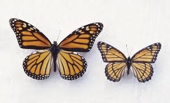
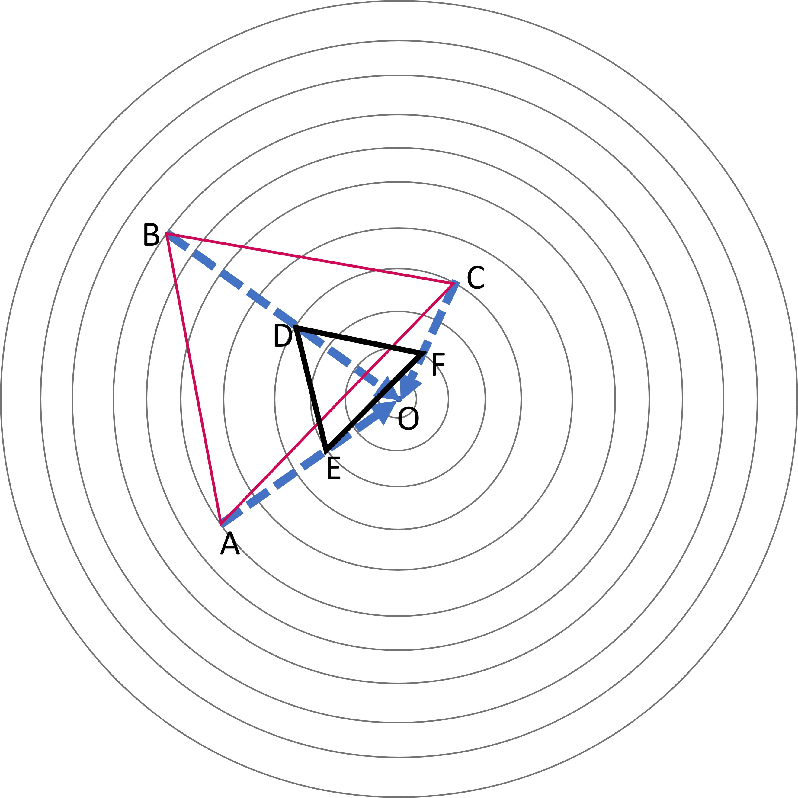
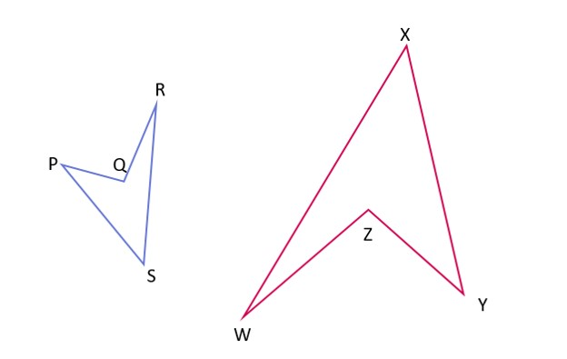
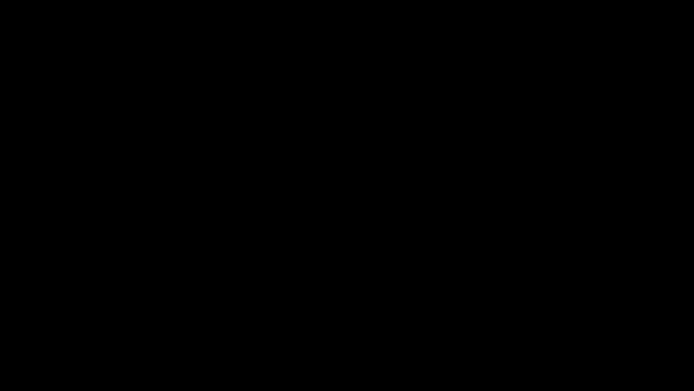

## Similarity
Similarity is the term used to describe the relation of two or more objects with the same shapes. The following example can be observed. 

9.16

The two butterflies have the exact same shape but their sizes aren't the same. The one on the left is larger than the one on the right. Thus the two butterflies are known to be similar to each other. If they were the exact same size, they would be congruent. While working with abstract objects like triangles, quadrilaterals, or pentagons, the shape is compared on the basis of the angles between the sides. 
It is related to dilations because dilation also produced figures of the same shape. We learned that the length of the sides of a shape is multiplied (or divided) by a constant number when dilated. It is essential to understand that if any of the sides gets multiplied by a different number than the other remaining sides, the shape of the figure will change because the ratio of sides in the shape will not remain the same and also the object, the image, and the origin won't lie on the same line as in the previous cases. This would nor produce scaled images that are similar to the object. 
In similarity, the scale factor is used as the constant ratio between the corresponding sides. Let's observe the dilated triangle in the previous case.

9.8
We know that the dilation was done with a scale factor of 1/2 so all the sides were halved. 
DE/AB = DF/BC = EF/AC =1/2
This equation can be interpreted as: 1 is half of 2 so every numerator part must be half of the denominator. So, DE is half of AB, DF is half of BC, and EF is half of AC. 
This can also be written in reverse like below:
AB/DE = BC/DF = AC/EF = 2
2 is equivalent to 2/1. So, since 2 is double of 1, AB is double of DE, BC is double of DF, and AC is double of EF. 
Also, the object and image points lie on the same line so they are corresponding vertices and the angles formed on these vertices are corresponding angles. Corresponding angles must be equal in similar triangles even though the sides aren't equal. The corresponding points were easier to find out in this case.
∠A = ∠E, ∠B = ∠D, ∠C = ∠F
The corresponding sides can be identified with the help of equal corresponding angles. 
If ∠A and ∠E are equal, then the sides opposite to them i.e. BC and DF are corresponding sides. 
If ∠B and ∠D are equal, then the sides opposite to them i.e. AC and EF are corresponding sides, and so on.

### Combination of rigid and non-rigid transformations
Have a look at the two figures.
 
9.17

These two figures are similar to each other. Can you locate the corresponding points?
First of all, we need to contemplate if they are congruent or not. For them to be congruent, one or a combination of rigid transformations should turn one object into the other. Since we clearly see that they have different sizes and no rigid transformation changes size, they are not congruent. 
However, in case of similarity, you can get one object from the other through a combination of one or more rigid transformations along with dilation. 

9.18

In this case, it is found to be the combination of rotation and dilation but in other cases, there might be more processes involved. 
We can track down the different vertices of the object so that the corresponding points are found. R is the corresponding point of W, Q is for Z, P is for Y and S is for X. 
It would be helpful to find out what transformation processes were followed to get the image out of the object but it isn't always straightforward. 
In those cases, measuring the angles in the two shapes given can be helpful. We measure one of the angles of the object and try to match them to one of the angles in the other polygon. Here R is the smallest angle in the polygon and if it is measured will give the same value as that of the angle made at W. The same goes for the largest angle Q which is equal to Z in the second polygon. 
PS is transformed into XY, RS into WX, QR into WZ, and PQ into ZY. These transformed object and image sides are known as corresponding sides. 

In general, corresponding sides in similar figures are identified by first measuring the lengths. After that, we arrange the sides in the same figure in ascending order according to their lengths. 
PQ, QR, PS, and RS for the first figure, 
ZY, WZ, XY, and XW for the second figure
Thus PQ is the corresponding side of ZY, QR is the corresponding side of WZ, PS for XY, and RS for XW. 
### Checking if the given shapes are familiar
Observe the two figures; are they similar to each other?

9.19

The blue rectangle has a length of 3 units and a width of 2. The rectangle in pink is 3 units in width and 4 units in length. The rectangles are oriented in the same manner. The longer side is horizontal and the shorter one is vertical. One way of checking is by finding the dilation center. In this process, it is found out if the lines joining the corresponding points on the same side meet at a common point.

9.20
 
Here the green dotted line joins the corresponding points. Since the blue rectangle is smaller, the center of dilation if present must be towards its side. We produce the green dotted lines towards that side. 

9.21

It can be seen that the lines meet at three different points. If they had met at one point then the figures would have been similar. 
Another method is comparing the length and widths with each other. The width of the rectangle is 2 units while it is 3 units for the larger. The larger rectangle is 3/2 or 1.5 times wider than the smaller one. The lengths are 3 and 4 respectively. The larger rectangle is 4/3 or 1.33 times longer than the smaller rectangle. This doesn't show consistency as 1.33 and 1.5 aren't equal to each other. So, the figures aren't similar to each other. Remember that the ratio needs to be the same.
