Rotation
Rotation is the act of turning an object. It is the process by which the orientation of the object is changed by angular displacement (meaning rotating the object at a certain angle) with respect to a fixed point. 
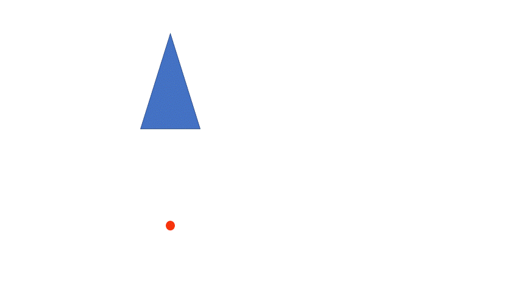
8.14

The fixed point is needed because the rotation has to have a certain point to rotate on. 
Do you notice how the door knob is rotated to open the door? 
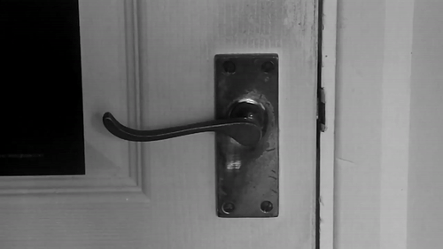
8.15

Even the knob is fixed at one point such that the rotation can occur with respect to that point. This point is known as the center of rotation and the displacement is expressed in terms of degrees along with the direction of rotation. 
For example, the doorknob rotates around 90° degrees or one-quarter when rotated fully. What is the direction though?
Here the knob seems to follow a direction that is opposite to that of the clock so it is termed an anticlockwise direction. 
For convention, the anticlockwise direction is taken as positive and the clockwise direction is taken as negative. 
These angles are inverses of each other. For example, turning 60° degrees clockwise is the same as 300° degrees anticlockwise, i.e., -60° gives the same image as +300°. 
Turning 45° clockwise is the same as 315° anticlockwise. 45° clockwise is written as -45° and 315° anticlockwise is written as 315°. That is why 315° and -45° rotation is the same. The images for such rotation are shown below. 
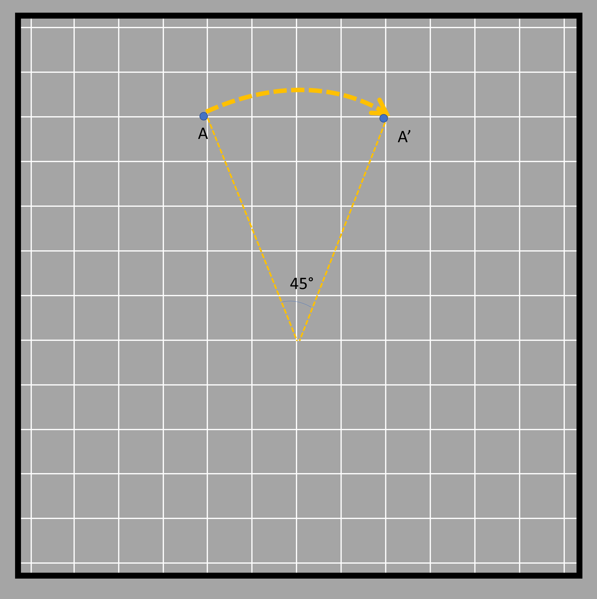
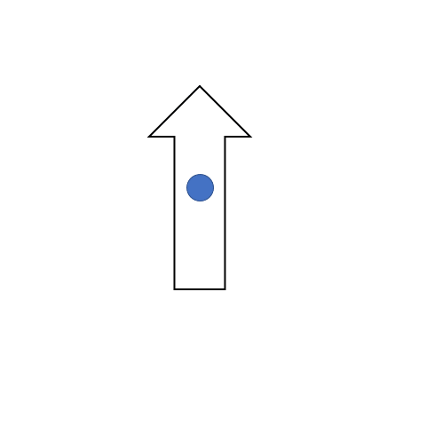
8.16 and 8.17

This phenomenon is the same for two degrees of rotation whose values when added give 360° degrees (without the sign!). 
One such example is shown in the figure below where the arrow pointed toward the top rotates and points toward the right when rotated clockwise 90° degrees. That same shape can be obtained when it is rotated 270° degrees in the opposite direction, which is an anticlockwise direction. Here the center of rotation is shown in the middle. 

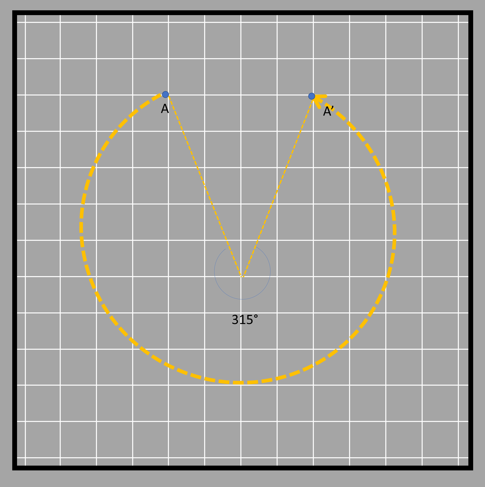
8.18 and 8.19

Here are some figures of objects being rotated. 
We have a triangle ABC that is rotated - 45° degrees (clockwise) about the center X (center of rotation). The rotation angle is shown for point A only. 
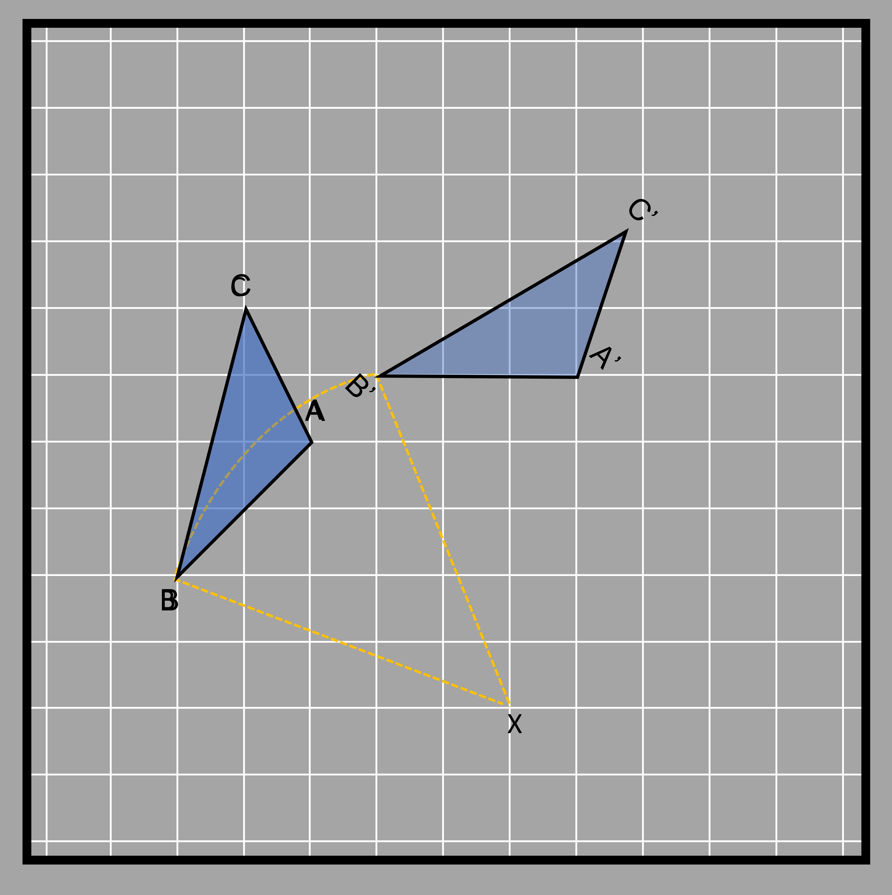
8.31

Each of the three points and their rotation is shown in different colors in the figure. All of the rotations measure 45° degrees clockwise from the line joining the point to be rotated and the center of rotation. The detailed rotation of other points is shown in the diagram below. 
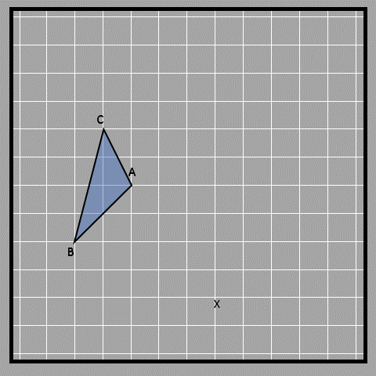
8.20

This rotation makes an arc in all three cases, with the center of rotation as the center of different circles (as denoted by the three colors below). This is the point where all radii of the arc meet, which are the lines from the initial point and the lines from the rotated point. You can clearly see this below.
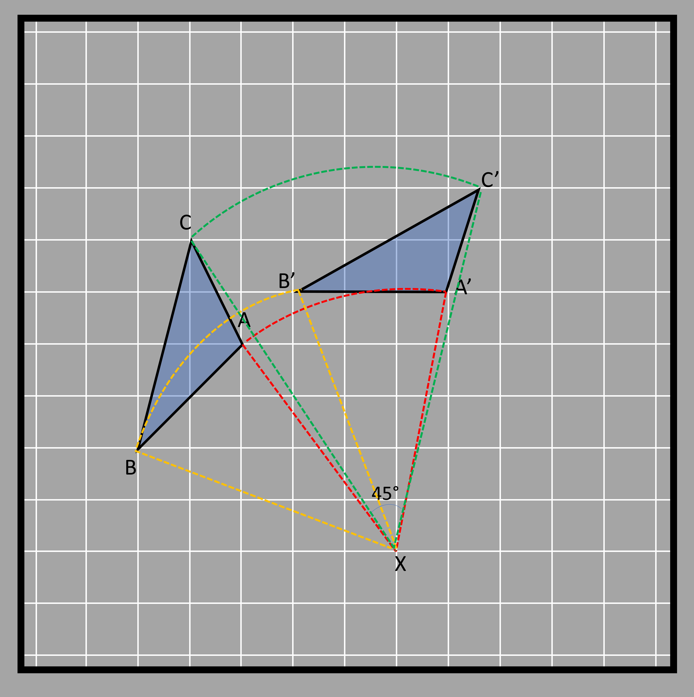
8.21

Other examples of rotation are shown in the different figures below. The arrow in the arcs gives the direction of rotation. In the examples below, the direction of rotation is clockwise. The magnitude of rotation is given as a negative value for the clockwise direction and a positive for the anticlockwise direction. 

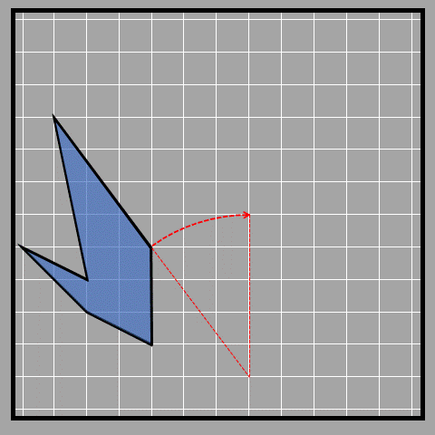
8.16 and 8.22

Symmetry by rotation
Like with reflection, we can use rotation to explain a type of symmetry of 2D shapes. Let's see what it actually is and how this type of symmetry is different from reflective symmetry.
We all know that 360° degrees make up one full circle or rotation. It should also be obvious that any object that rotates 360° degrees about its center will return back to its original position, meaning the new image is symmetric to the original. This is an example of rotational symmetry. 
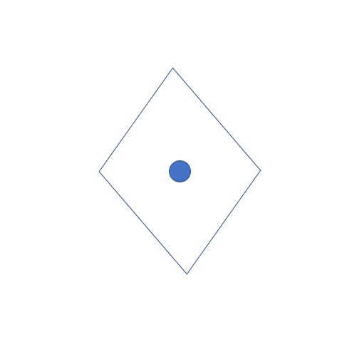
8.23

When an object rotates about its center and the image looks the same as the original, then the object has rotational symmetry. All objects have at least one rotational symmetry since one full circle always gives us the same image. 
But there are certain shapes that return to their original position prior to completing the 360° degrees rotation. 
For example, a square gets to its initial position (or the initial and rotation images look the same) at 90° degrees, 180° degrees, 270° degrees, and ultimately 360° degrees. This tells us that a square has four rotational symmetries.

8.24

A rectangle gets to its original position at 180° and 360° degrees only. Thus, a rectangle only has 2 rotational symmetries.
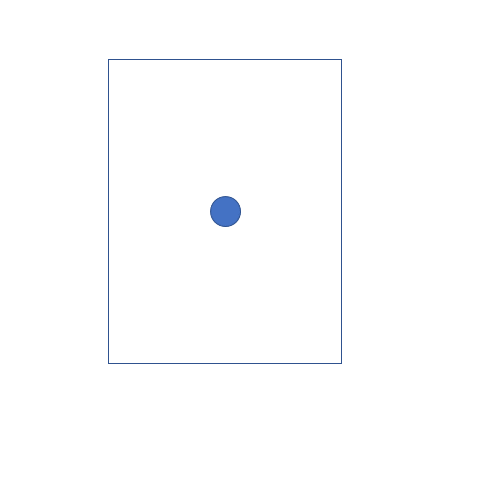
8.25  

