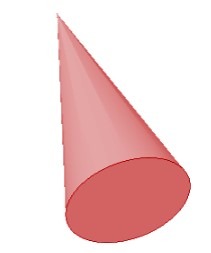
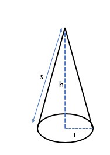
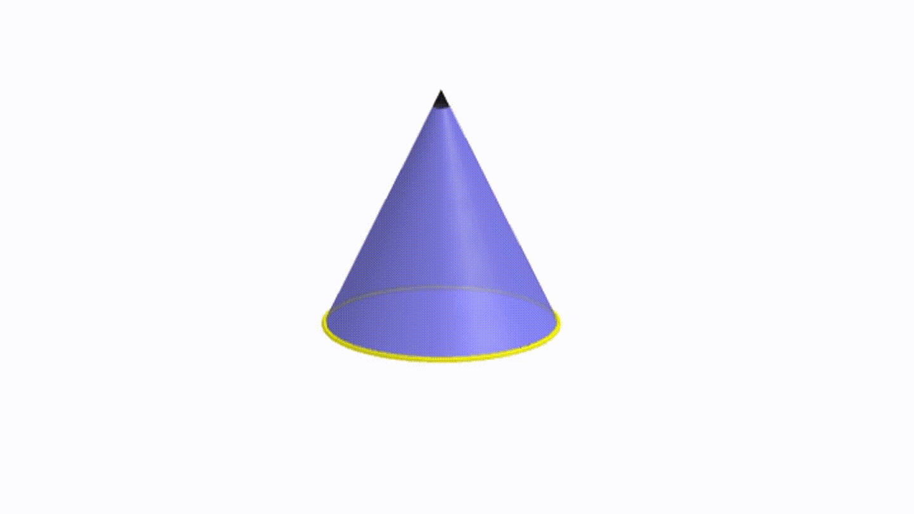
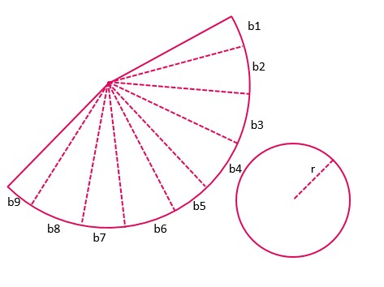
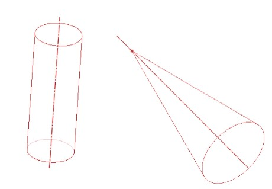
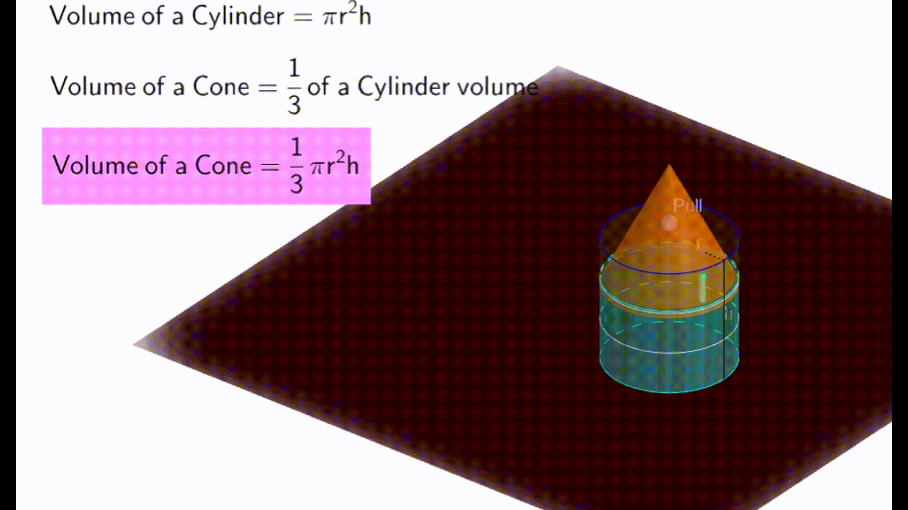

Cone
The surface area of the cone
Let's have a look at the cone next. A cone is to the cylinder as a pyramid is to a prism. The area of the circle at the base goes on decreasing as the height of the cone increases, and finally meets at the highest height.

7.6
 
The height of the cone is the perpendicular distance from the center of the base to the highest point. The height from the edge of the circle to the top point is the cone's slant height. The slant height is measured along the curved surface of the cone that is a bit slanted with the vertical. 

7.7

The curved surface formed is such that when it is opened as we did with the cylinder, we get the shape shown in the figure. 

7.8
 

The curved surface can be divided into small triangles by using the bases on the arc-shaped part. The heights of all triangles are equal to the slant length (l) of the cone. If there are many such divisions made, the curved part will start to look straight,
like in a triangle. 

7.9

Let the bases of all triangles be b1, b2, b3, b4, b5, ……….. to n parts
Area of triangle = ½ x base x height 
Area of all triangles = (½ x b1 x l) + (½ x b2 x l) + ...... + (½ x bn x l)   
Area of all triangles = ½ x (b1+b2+b3+b4+......+bn) x l 
Here, l is the slant height of the cone and must not be confused with the actual height of the cone. 
Regardless of what the values of bases are, their sum must be equal to the circumference of the base circle, since the two coincide. 
b1 + b2 + b3 + b4 + ...... + bn = 2πr
Total area of the curved surface = ½ x (b1+b2+b3+b4+......+bn) x l
= ½ x 2πr x l
Curved surface area of the cone = πrl
Apart from the curved part, there is one circle with area πr2
Total surface area = πrl + πr^2
= πr (l + r)

Volume of cone

7.10

The volume of the cone is found to be ⅓ of the total volume of the cylinder with the same radius and height. 
It can be verified experimentally by taking a cone and a cylinder of the same base area and height. If a liquid is filled in the cone and then emptied into the cylinder, it requires three cone full of liquid fill the cylinder up to the brim.

7.11

Observe the above image, the initial height of liquid inside the cylinder is 2/3 times the actual height of the cylinder. When a solid cone of the same height as the cylinder is dropped into the liquid, the cylinder is filled to the brim.
Therefore, 
The volume of the cylinder = 2/3 of the volume of the cylinder + volume of the cone
or, volume of cylinder-2/3 volume of cylinder = volume of cone
or, [1-(2/3)] of volume of cylinder = volume of cone
So, volume of cone = ⅓ πr2h
