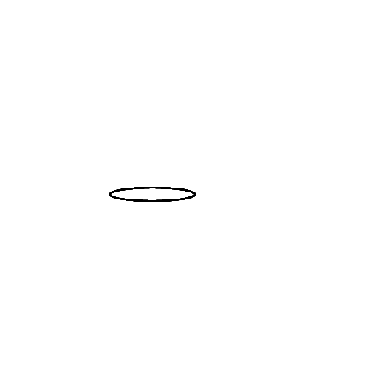
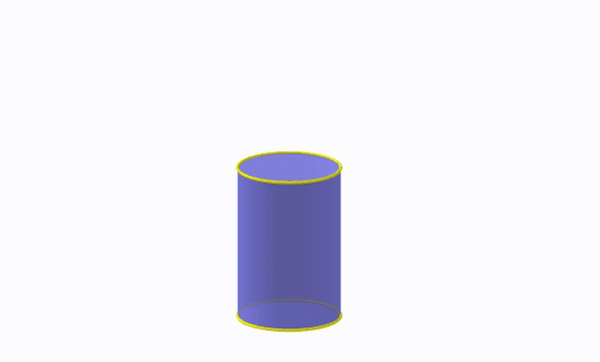
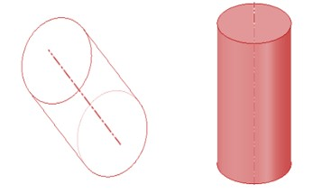
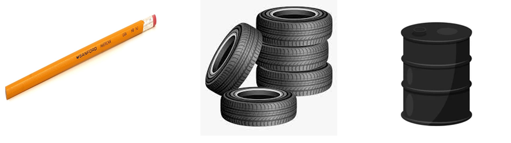
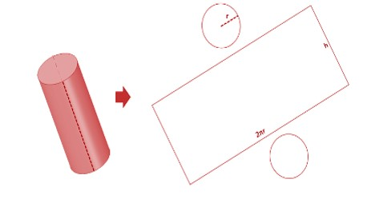

In grade 7, we learned about the different types of Polyhedra and how to distinguish between Polyhedra and Non-Polyhedra. Non-polyhedra is the term used for objects that contain curved surfaces since polyhedra should only have flat surfaces. For example, cube cuboids, pyramids, etc.
We will now look at Non-Polyhedra, surfaces that do have curved surfaces. Examples of these include cylinders, cones, and spheres. 
Cylinder
Let's start with a cylinder. It is an object formed by stacking multiple circles of the same radii one on top of the other, or by rolling a rectangle and joining the opposite edges that meet. 

7.1

If the surfaces of the cylinder are spread out then we get something like shown below. 

7.2 7.3

Having observed the figure above, which real-life objects do you think match this shape? An unsharpened pencil is one such object, tanks are another such object. Tires are also cylindrical or more specifically hollow cylinders.  

7.4

When we were talking about a prism, the volume was found by multiplying the base area by the height. Even though a cylinder isn't necessarily considered a prism, the same method is used; finding the base area and multiplying it by the height. 
Since the base is circular here, we multiply the height by the base area of the circle. 
Base area = area of circle = πr^2
Volume = Base area x height = πr^2 x h
Finding the surface area of the cylinder is a little bit more tricky than finding the volume. With Polyhedra, it was easy because all of the shapes were flat, and we could easily find the area of the flat 2D objects. 
In a cylinder, the two bases are flat circles, but a curved surface joins the two circles. We can cut the curved surface, in a way that is parallel to the axis. This gives a rectangle and two circles at the two ends.   

7.2

7.5

The thing that has to be noticed is that the length of the rectangle is equal to the perimeter/circumference of the circle at the base because the whole curved surface is entwined along the circumference. The width of the rectangle is equal to the height of the cylinder. Thus, we now have one rectangle with its precise dimensions and two circles. All of their areas can be easily found using the formulae learned before. 
Total surface area = area of two circles + area of the rectangle
= πr^2 + πr^2 + (2πr x h)
= 2πr^2 + 2πrh
= 2πr (r + h)
The surfaces of cylinders is the curved part that can be unfolded into a rectangle, along with that there are two circles that are top and bottom of the cylinder. 
If you only want the curved surface area (area of the curved part), it is simply the area of the rectangle, hence given by 2πrh (since we exclude the two circles).
