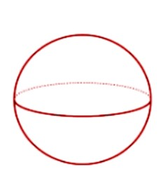
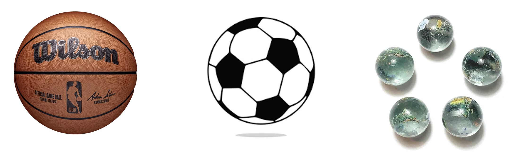
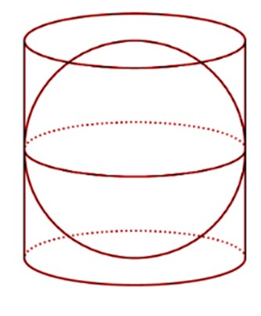
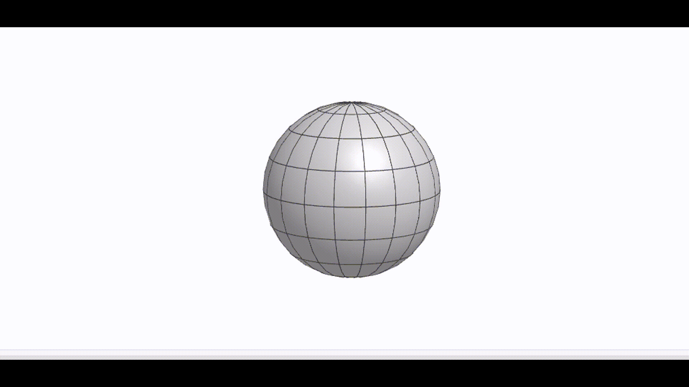
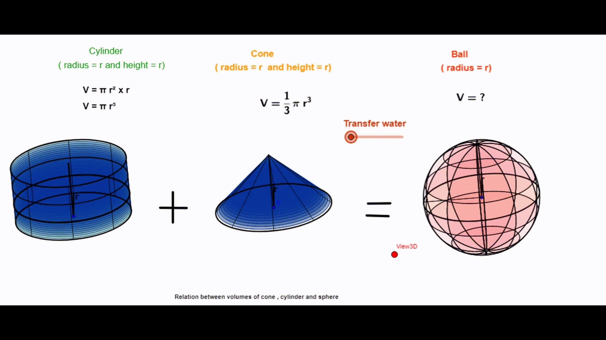
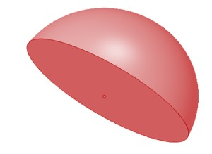
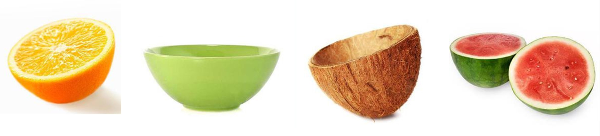

Sphere
Another type of 3D object with a curved surface is a sphere. It does not have any flat face at all. 

7.12

Observing the above image, what objects can you think of that look like it?
Football, basketball, volleyball, and many other balls that are used in sports are spherical in shape. A ball is used synonymously in place of the sphere due to this.

7.13
 
The total surface area of the sphere
The surface area of the sphere is measured with the help of a cylinder of the same dimensions as the sphere. Meaning the height of the cylinder is the same as the diameter of the sphere and the diameter of the sphere and cylinder are the same as well. Basically, the sphere perfectly fits in a cylinder, as shown. Note that the cylinder is hollow, with no bases.

7.14

It is found that the cylinder completely covers the upper and lower surfaces of the sphere. This means that the lateral/curved surface area of the cylinder and the sphere are the same. 

7.15

Lateral surface area of the cylinder = 2πrh = 2πr x 2r = 4πr2
[Height of cylinder is the same as the diameter of the sphere, 2r]
This is the total surface area of the sphere.

Volume of sphere
To find the volume of the sphere, a cone of the same height and radius as the cylinder (from before) is filled with a liquid. The liquid from the cylinder and cone is emptied on the sphere of the same radius and it fits exactly.
This means that the volume of the cone and cylinder when added together gives the volume of the sphere.

7.16 

The volume of the cylinder + volume of the cone = Volume of the sphere
or, Volume of sphere = 
= πr2 x r + (⅓) x πr2 x r
= (4/3) x πr3
Hemisphere
Half a sphere or the shape that we get when we cut the ball in half is a hemisphere. 

7.17

What objects resemble a hemisphere?
Half-cut foods like lemon, coconut, and watermelon are suitable examples. Utensils such as bowls are also hemispherical. One thing to notice is that the bowl is hollow because it has space whereas the other hemispheres shown are solid because there is no space in between. 

7.18

Volume of hemisphere
Since the hemisphere is literally a sphere cut in half, it has a volume of exactly half of the sphere.
Volume of hemisphere = [(4/3) x πr^3]/2 = (2/3) x πr^3
The surface area of the hemisphere
When the sphere is cut in half, half of the surface area remains. So, the lateral/curved surface area of the hemisphere is equal to half of the total surface area of the sphere.
The lateral surface area of the hemisphere = Total surface area of sphere/2
= (4πr^2)/2
= 2πr^2
But notice that there is now a flat surface at the bottom of the curved surface, which is the circular base. So, for the total surface, we need to add the area of this circle, which has the same radius as the hemisphere. 
The total surface area of the hemisphere = Lateral surface area of the hemisphere + area of the base circle
= 2πr^2 + πr^2
= 3πr^2
