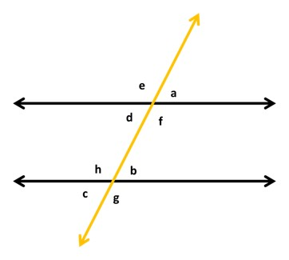
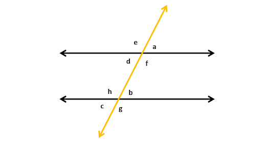
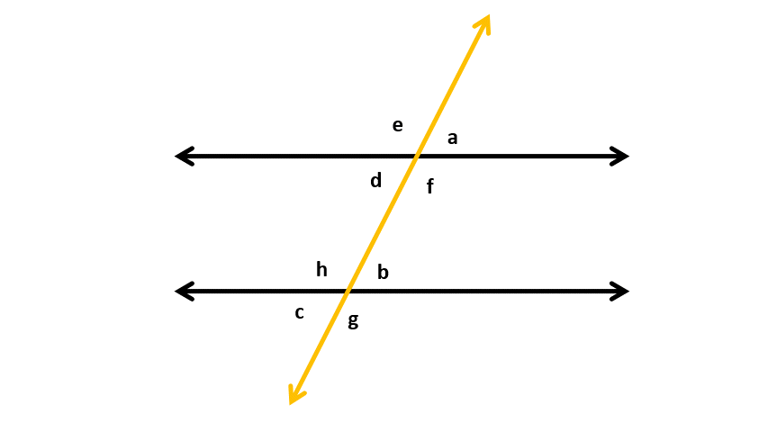
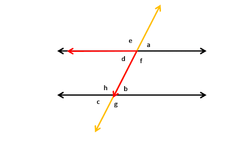

## Angles made by transversal between parallel lines

When lines don't meet and are the same distance apart all the time, they are called parallel lines. If lines aren't parallel and meet at one point, they are called intersecting lines. The angle between two lines is found at the point of intersection. If lines are parallel, they don't meet, so the angle between them is either 0° or 180° degrees. When a line that isn't 180° degrees goes through parallel lines, it's called a "transversal" (like the yellow line in the picture).

When a transversal cuts parallel lines (two parallel lines in this case)  in two different places, then we see that 8 angles are formed; 4 at each intersection point between the line and the transversal.

Since the lines are parallel, there exist different relationships between the angles formed at separate points. The relations are derived on the grounds of adjacent angles in a straight line and vertically opposite angles at each intersection point made by the transversal. Let’s look at them one by one.

## Vertically opposite angles 

Here, a and d are equal because they are vertically opposite. Angles e and f are also equal because they are vertically opposite. What other pairs are vertically opposite here? Hint: There are a total of 4 pairs of vertically opposite angles or VOAs.

10.2

## Supplementary angles

Here, e and a are two angles that make up a straight line, so adding them must give 180 degrees. These are supplementary angles. How many other pairs of supplementary angles are there? Hint! It’s 8!

## Corresponding angles

Angle a, when moved to angle b shows that they are equal since they completely overlap.

Look at the two angles a and b carefully. They’re simply the same angles in different positions. They also sort of form an F shape. Such angles are corresponding angles and they are equal. Angles f and g are also corresponding angles. There are two more pairs of corresponding angles in the figure. Can you guess which?

## Alternate angles

Now, we know that a and b are equal and so are a and d (since they are VOAs). This means that d and b also need to be equal, and they are! They sort of make a Z pattern. Such angles are called alternate angles and they are equal. This also applies to an opposite-looking Z shape, making f and h as equal as well.

## Co-Interior and angles

Let’s look at angles a, f, and b. We know that a and f are supplementary angles since they make a straight line. So, we have a + f = 180°. We also know that a and b are equal (corresponding angles). So, if we replace a in the equation with b, we get b + f = 180. The angles b and f form a sort of C shape. These are co-interior angles, and they are supplementary angles, meaning their sum is 180° degrees. Another pair is d and h. Finally, let’s look at angles a, f, b, and g.

We know that b + g = 180° and that a = b (corresponding angles). So, we can write the equation, and a + g = 180°. a and g are exterior angles on the same side of the transversal. They are co-exterior angles and are also supplementary. The other pair is e and c. 

If we get a scenario in which two parallel lines are cut by a transversal, knowing only one angle’s value is enough to find all the values of the angles.

