## Dilation: The non-rigid transformation

We've learned about some transformations that keep the shape and size of an object the same. They were all rigid transformations. But now, we're going to talk about a different kind of transformation, a non rigid transformation called dilation. 

Dilation is when the size of the object changes, but the shape stays the same. It's like when you use a magnifying glass to make something look bigger. Or when you look at Google Earth and everything looks smaller than they actually are in real life. 

Say you have a square that's 2 units long on each side and you double the length of each side, you get a new square that's 4 units long on each side. The new square is a bigger version of the original square, but it has the same shape. This is called dilation! You can also make the square smaller by cutting each side in half. The new square will be a smaller version of the original square, but it will still have the same shape. They are ‘similar’ to each other, which is a term used to describe images with the same shape but different size. Check out the picture below to see what we mean.

It is important to note that dilation does not give us congruent images like rotation, reflection, and translation did. 

In case of images that have been dilated, if the original image has lines that are parallel, they stay parallel in the dilated image as well. If the lines are perpendicular in the original, they stay perpendicular in the dilated image as well. Essentially, all the angles stay the same. 

The center is super important in dilation. It's the point where the object is dilated from (essentially the point with respect to which an object is dilated to give bigger or smaller images). The object seems to disappear at the center. 

The scale factor tells us how much bigger or smaller the image is compared to the object. We find the scale factor by dividing the distance from the center to the dilated image by the distance from the center to the original object. Just like with rotation, we can connect the object and its image with a line that goes through the center.

The given figure is an example of dilation, in which the object has been dilated with a scale factor of 3 from the center O shown.

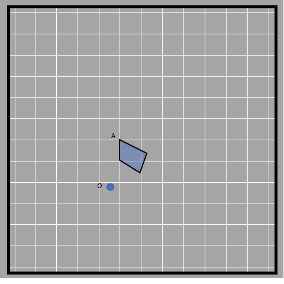

Scale factor is a fancy way of saying how much bigger or smaller an image is compared to the object. As we have mentioned, we measure this by finding the ratio of the distance from the center of the object to the center of the image. In this example, the ratio is 3, since OA’/OA = 3. The same ratio is maintained by all of the sides of the image and object. The sides of the larger quadrilateral are three times larger than that of the smaller quadrilateral. This means that the scale factor is also the number of times the image is bigger or smaller than the object.
It's like when you have equivalent ratios, where all the numbers are multiplied by the same amount to keep the same relationship. For example, 7 divided by 14 is the same as 0.5, and so is 6 divided by 12 and 49 divided by 98. 

The proportional relationship is not just limited to the lines that combine a point of object to center and lines that combine a point of dilated image to center (like OA and OA’). These scaled copies also have proportional relationships between corresponding sides (the original side and its scaled side). In the case of the quadrilateral above, the image is 3 times bigger than the object, for all measurements. This means that the ratio of corresponding sides of the object and image maintains a constant value, 3. This applies to all dilated figures for all points. The scale factor basically is the dimension of the dilates image divided by the corresponding dimension of the object. If the ratio is higher than 1, then the given object has been magnified in the image. If it is less than 1, the object gets diminished in the image and if the scale factor is 1 then the object and image are of the same size. Some more examples of similar shapes with different centers used:

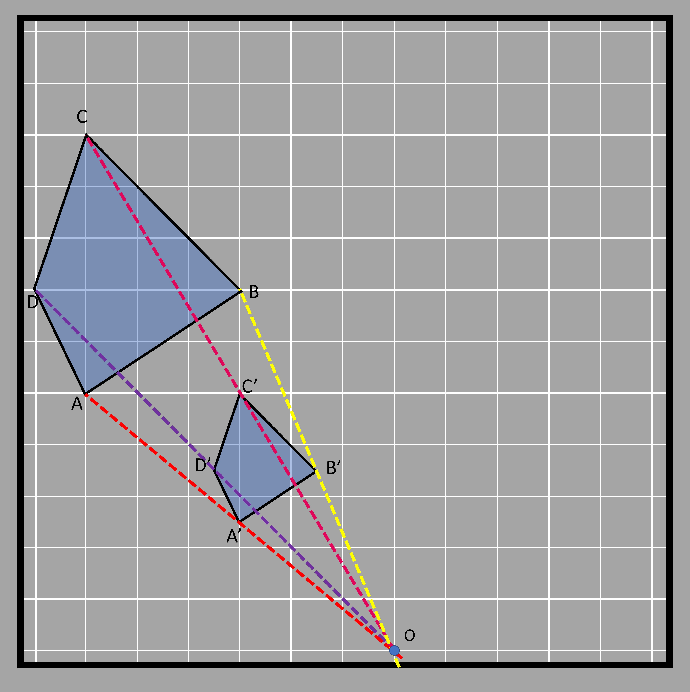
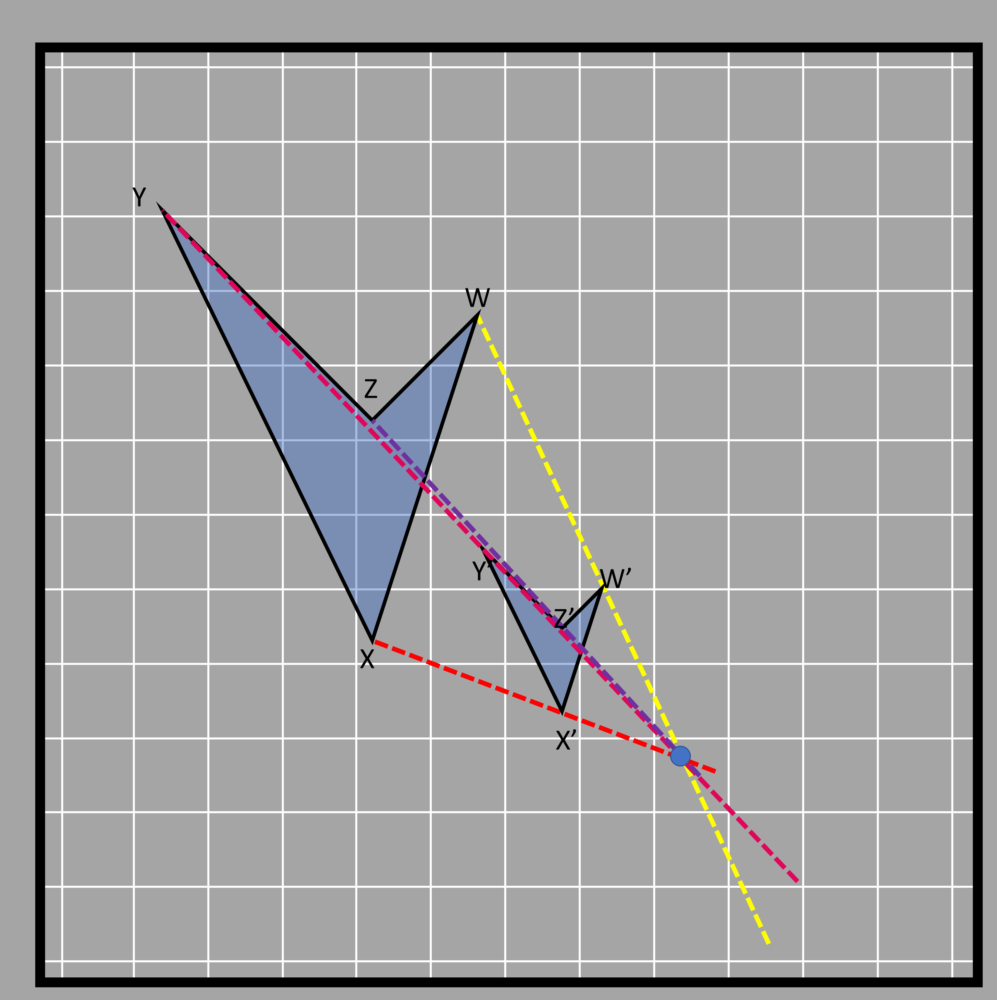

The different colored lines join the object and their respective images whereas the point at which the lines intersect is in the center of dilation.

## Dilation with circular grid

It’s easy to understand dilation with a circular grid. Let’s see what this means.
Let’s assume we have a triangle to dilate that is situated in a circular grid as shown in the figure.

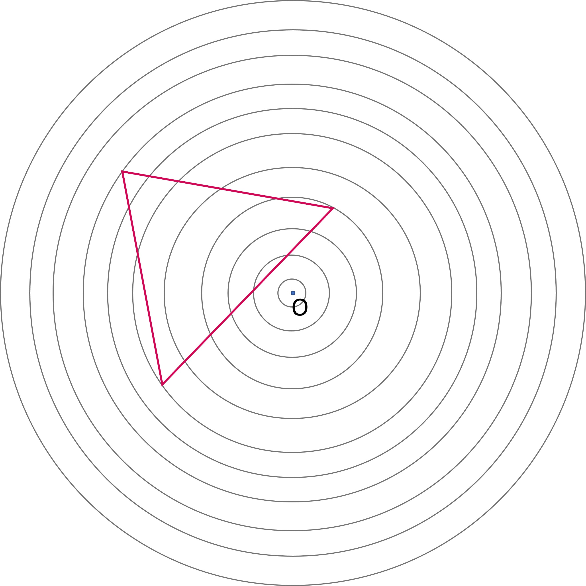

We are given the task of dilating the triangle by a 1/2 scale factor (or 0.5). It means that the sides of the triangle formed will be half of the original triangle. That is achieved by locating the three vertices of the triangle first and then halving.

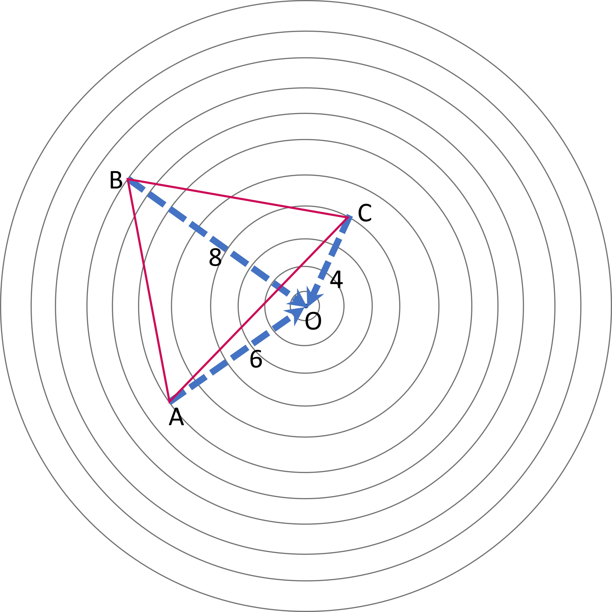

Let’s go through it step by step. 
1. We see that the points B, A, and C are 8, 6, and 4 units far from the origin respectively (done by counting the rings away from the origin or center). We can also draw lines that connect each point to the origin, as shown with the blue lines above to help us with this.
2. The points after transformation will be 8/2, 6/2, and 4/2 units from the origin. The points of the dilated image will also lie in the same line that joins the vertices and origin (the blue lines). 
3. Looking at point B, we see that it lies 8 rings farther from the center, so the image of this point (B’) will be at the 4th ring as it is half distance from the center. We do the same for all three points. The image triangle is shown in the diagram below.

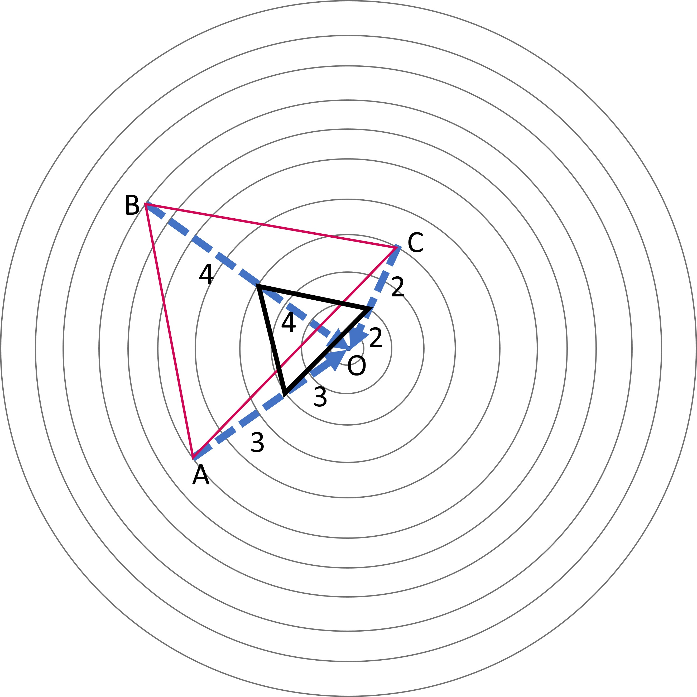

The dilated triangle formed is DEF, which has its sides half that of triangle ABC.

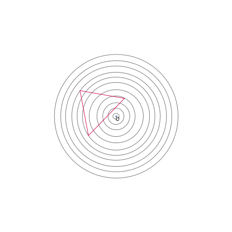

## Dilation in a rectangular grid

Let’s observe a similar example to understand how dilation is done in a rectangular grid instead of a circular one.

We first need to locate where the center of dilation is. It is located 2 units below the upper length and 2 units above the lower length of the rectangle. It is also 2 units to the right from the left side and 3 units to the left from the right side.

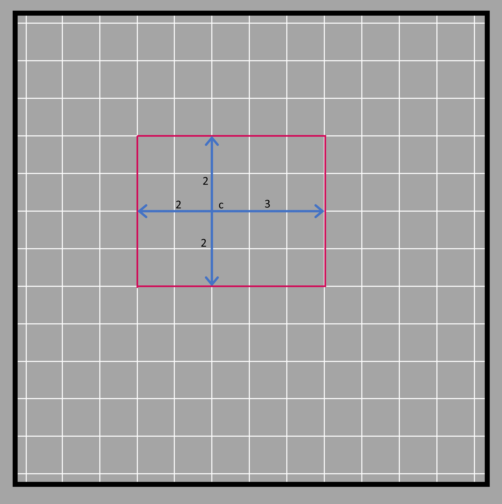

If the given rectangle was to be dilated with the scale factor of 2, we must understand that the distance of the center between the sides will be doubled. That means the four sides of the rectangle will be pushed even further (at a double distance) from the center. The left side that was 2 units away is pushed 2 units further making it 4 units far from the center. The same is done with other sides too.

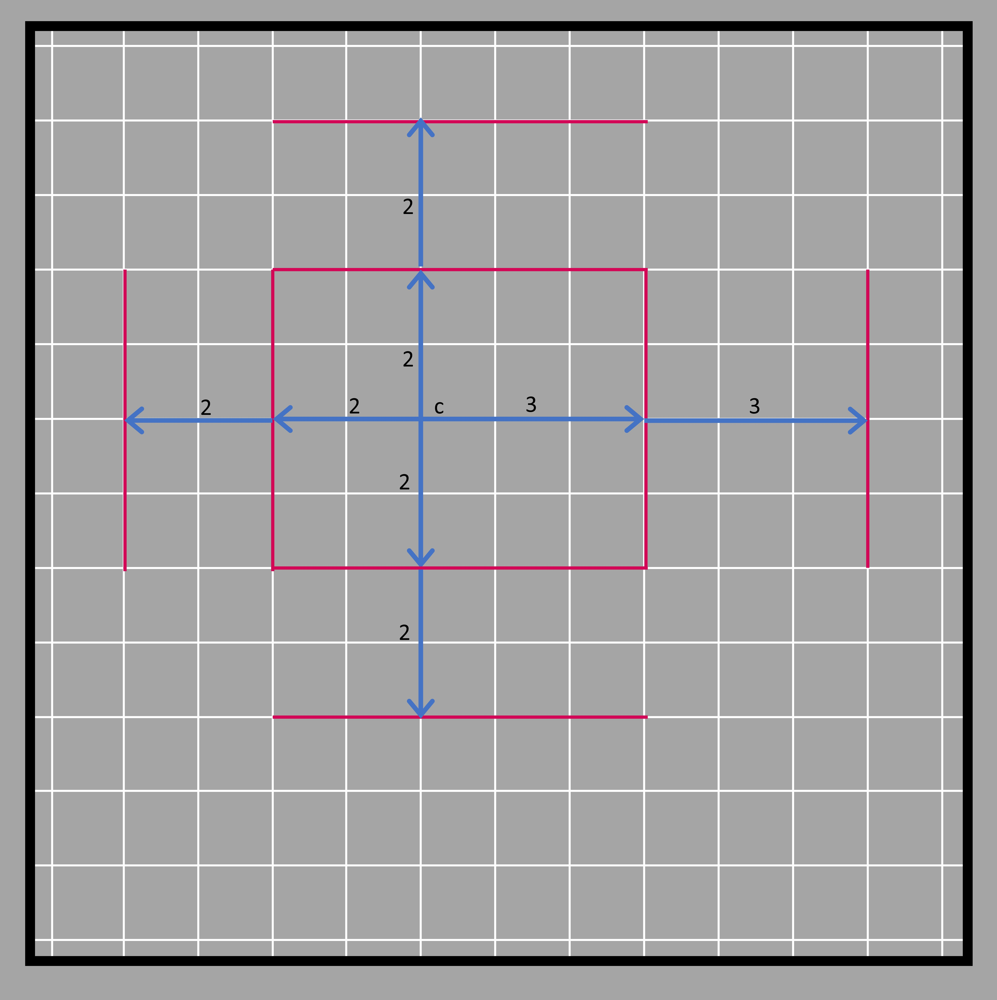

After that, the sides are produced and joined together.

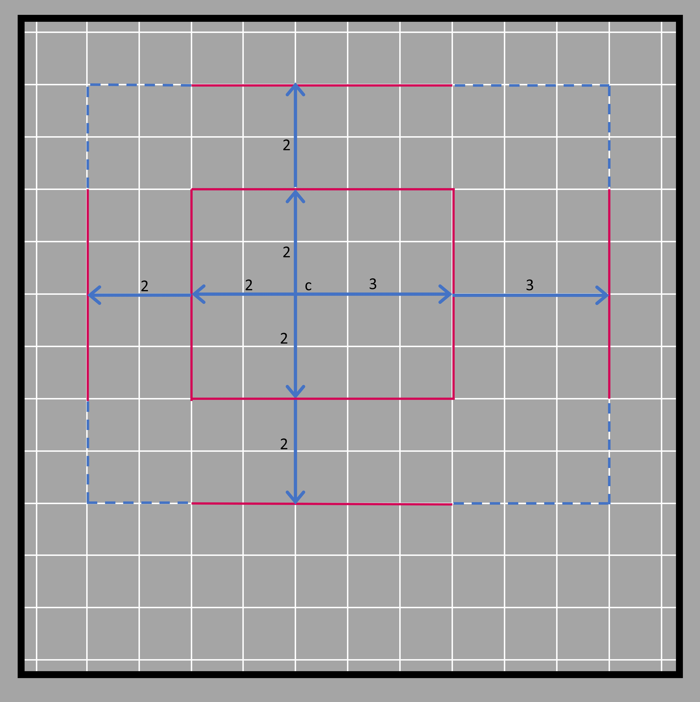

The rectangle we get at the end is shown in the figure below.

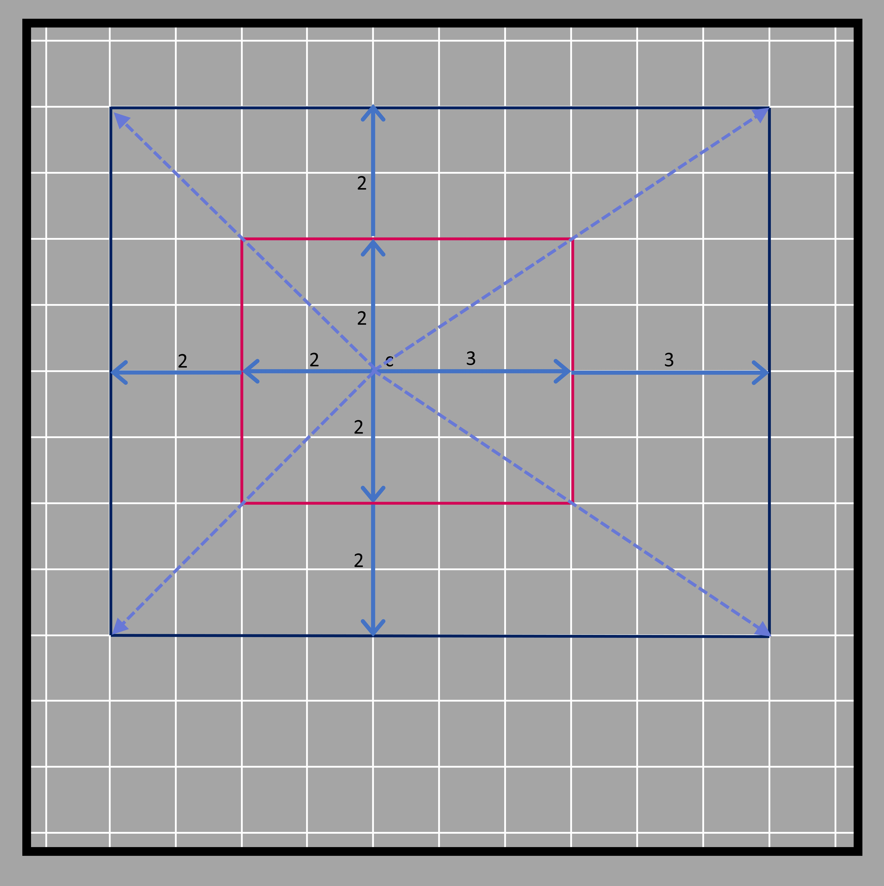

All the steps described above are shown step by step in the diagram below.

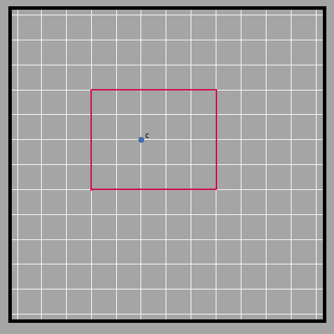
