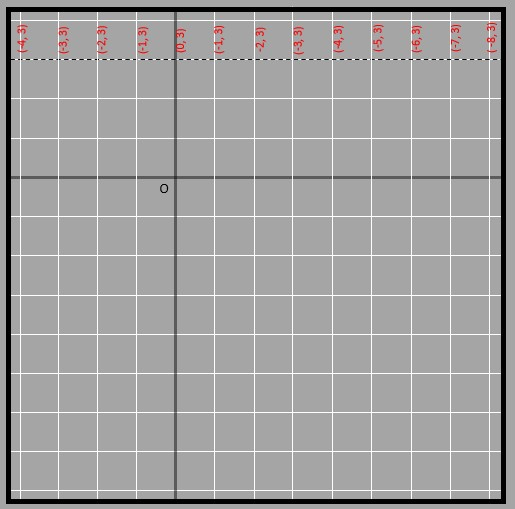
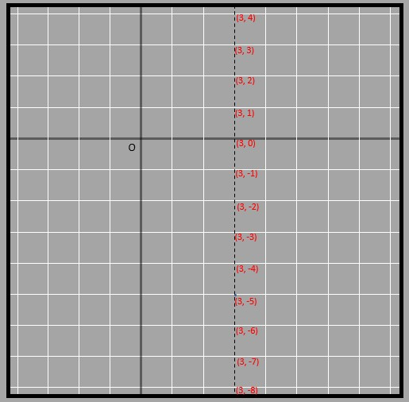
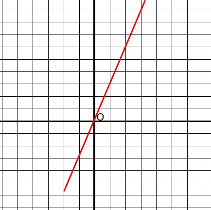
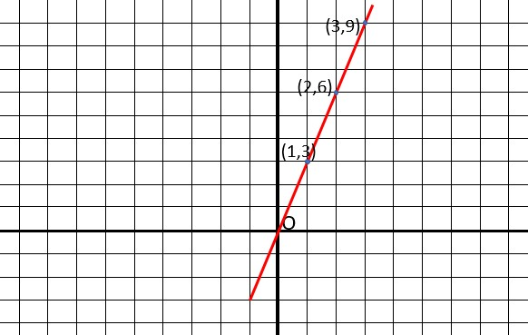
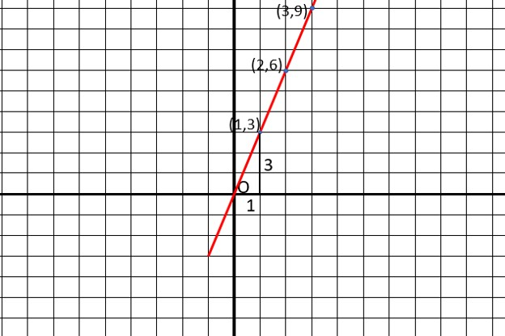
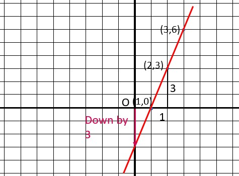
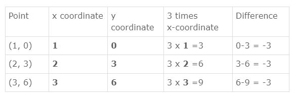
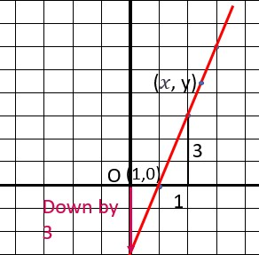
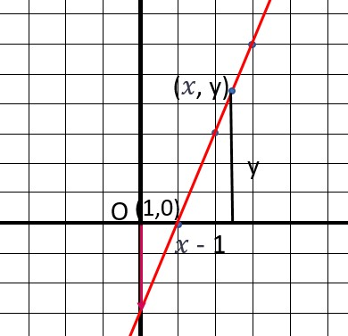

## Equation of horizontal and vertical lines

A line is made up of many points, but we only need two to create it. However, those two points don't tell us all the other points the line goes through. For example, a line that connects (1, 1) and (5, 5) also goes through (2, 2), (3, 3), and so on. It would take a lot of time to list all those points! Luckily, we can use equations to define all the points on a line without having to list them one by one. 

Here, all of the coordinates that lie on the line have the same y coordinate -> 3. Thus the equation for this line is y = 3. Simple! Similarly, the vertical line shown below has all of its points having the same x coordinate of 3. Thus the equation of the line is x = 3.

## Equation of all lines

Not all lines are horizontal or vertical. So how do we figure out their equation? We use the slope! This is because the difference in the locations of any two points lying on the line is dependent on the slope, which is the same throughout the line. Look at the blue line in these pictures. In the first picture, when we go 4 steps to the side, we also go 4 steps up. But in the second picture, when we go 8 steps to the side, we also go 8 steps up. This shows us that for every step we take to the side, we also go up one step.

Let’s try to find the equation of a straight line plotted in the graph given below.

We can clearly see that the line passes through points (1, 3), (2, 6), and (3, 9). The points beyond that aren’t shown because the graph has limited space here.

Let's figure out if a point that's not on the graph will be on the line. Like (25, 100). From the three coordinates, we see that the y-coordinate is 3 times the x-coordinate. So, if we multiply the x-coordinate by 3, we should get the y-coordinate. But for (25, 100), that's not true. Multiplying 25 by 3 gives 75, not 100. So, (25, 100) is not on the line. We can use this trick to check if any point is on the line or not. 

What about the equation of this line? Since all y values are three times the x value, we can generalize them to get y=3x. Using this equation, we can find the y-coordinate for any point on the line by putting the x-coordinate into the equation. IF we put in 25 for x, we get 75 as y, which further proves that (25, 100) do not lie on the given line. 

What about the slope of this line?

The slope, according to the triangle formed using the coordinates (1, 3) in the above figure, is 3. This is because 3/1 = 3. Easy, right? We also know that this value issame for all coordinates. If we go back to the equation we formed early, we have y = 3x. This 3 is the same as the slope! 

So, if the slope of a line passing through the origin is ’m’, y = mx is the equation of the equation. Easy enough to remember or generalize if you wanted, right?

What if there was a different kind of like that did not have such a simple relationship between y and x coordinates of points? Here is the same line as before, but it is 3 units below the y axis and it does not pass through the origin. 

The slope of the line is the same as before (3) but are the y coordinates equal to 3 times the x coordinates here? Let’s see. 

0 = 3 x 1  
3 = 3 x 2  
6 = 3 x 3  

We see that the equation or the relationships does not apply in this case. 

But what we can notice is that the y coordinate is 3 more than the actual value of 3 times the x coordinate. Look at the table below to make it more clear. 

Summarizing the table, we have the following relationships between the y and x coordinates:

3 x 1 - 3 = 0   
3 x 2 - 3 = 3   
3 x 3 - 3 = 6   

Since the line was pushed 3 units down, the y coordinate is 3 less than the 3 times the x coordinate. 
So we can generalize the relationship to get 3x - 3 = y 

The constant part (-3) that is in the equation is the point where the line meets the y-axis. If it meets the y-axis at the origin, the constant will be 0. We can see this in our previous example wheeren the line passed through the origins dn we get the equation y =3x, which is essentially y = 3x + 0. 

We can also find the equation by making a right-angled triangle whose hypotenuse is on the given line.

The slope of the line is 3, which we already know. Let’s take two random points on the line, one being an unknown (x, y) and the other being a known (1, 0). We can thus form a triangle using the line formed by these two coordinates as the hypotenuse. The reason we need unknown coordinates is because we are forming an equation where x and y can be replaced by any value. 
 

Using the formula of slope, we have vertical distance/horizontal distance = slope or height if triangle/base of triangle = slope.

y/(x-1) = 3  
y = 3(x - 1)  
y = 3x - 3  

We get the same equation! 

If we have an equation, we can easily find if a point lies on the line (as we say before for (25, 100). We could also find one of the coordinates if only the other is given. We simply put an assumed value of x to find out the corresponding value of y or vice versa. 

If the given equation is y = 7x -9, when 𝑥 = 0, y = 7.0 - 9 = -9.  

So, (0, -9) is a point on the given line. 

When y = 5, we get, 5 = 7x - 9.  
5 + 9 = 7x   
14 = 7x   
x = 14/7 = 2   

So, (2, 5) is a point on the given line.
