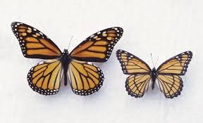
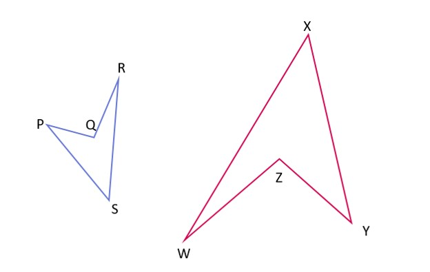
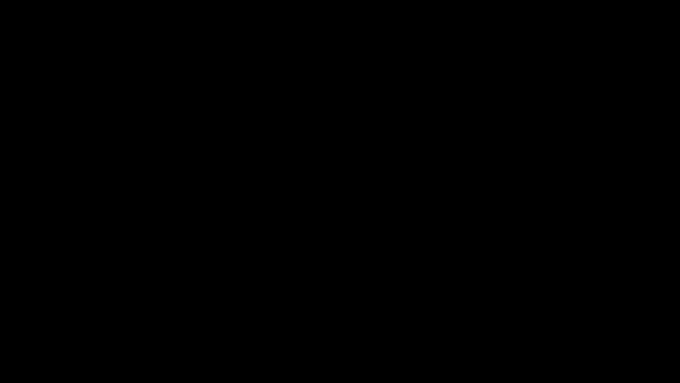

## What is similarity?

Similarity is used for two or more objects with the same shapes. Look at the following example. 

The two butterflies have ‘similar’ shapes. What this means is that the two butterflies have the same shape, but one is bigger than the other (meaning they have different sizes). If they were the exact same size, we would call them congruent. 

When we talk about shapes like triangles or pentagons, we compare their angles to see if they are similar. Similarity is usually used with dilation since dilation of shapes make similar shapes. Basically, can make a bigger or smaller version of a shape by multiplying or dividing the sides by the same number. But if we multiply one side by a different number than the others 
(say one side by 2 and the other by 5), the shape will change along with the size. This means that the scale factor (which is the ratio between the corresponding sides of two similar shapes) will not be the same. Hence, the diluted image and the original image are not similar. Let's look at an example of a dilated triangle.

We shrunk the shape using a scale factor of 1/2, which means we cut all the sides in half. 
We can write this as a fraction of the new side and old side, which will all be equal to ½.
DE/AB = DF/BC = EF/AC = 1/2 
This can be interpreted as: 1 is half of 2 so every numerator part must be half of the denominator. 
This means that DE is half of AB, DF is half of BC, and EF is half of AC. We can also write it the other way around, by taking the reciprocal of each. 
AB/DE = BC/DF = AC/EF = 2 
This means that AB is double DE, BC is double DF, and AC is double EF, since 2 is double of 1 (remember that 2 can be written as 2/1). 

The points on the original and new shapes lie on the same lines, so they match up. They are corresponding vertices. The angles on these matching points are called corresponding angles, and they are the same size even though the sides aren't the same. In this case, we can see that ∠A = ∠E, ∠B = ∠D, and ∠C = ∠F. We can use these matching angles to find the matching sides. For example, if ∠A and ∠E are the same size, then the sides opposite them (BC and DF) are matching sides, known as corresponding sides.

## Checking if the given shapes are similar

Observe the two figures. Are they similar to each other?

The blue rectangle has a length of 3 units and a width of 2. The rectangle in pink has 3 units in width and 4 units in length. The rectangles are oriented in the same manner. The longer side is horizontal and the shorter one is vertical. One way of checking if they are similar is by finding the dilation center. In this process, the point is found if the lines joining the corresponding points meet at a common point.

Here, the green dotted line joins the corresponding points. Since the blue rectangle is smaller, the center of dilation, if present, must be towards its side. We produce the green dotted lines towards that side.

We see that the lines meet at three different points. If they had met at one point then the figures would have been similar. 
Another method to check similarity is to compare the length and widths of the two images with each other. The width of the smaller rectangle is 2 units while it is 3 units for the larger. The larger rectangle is 3/2 or 1.5 times wider than the smaller one. The lengths are 3 and 4 respectively. The larger rectangle is 4/3 or 1.33 times longer than the smaller rectangle. This doesn’t show consistency as 1.33 and 1.5 aren’t equal to each other. So, the figures aren’t similar to each other. Remember that the ratio needs to be the same for figures to be similar.
We can also use another method, as shown:

Measuring angles can be helpful in figuring out if images are similar. 
Look at the given images:

 

We can compare the angles in the object and the image to see if they match. In this example, R is the smallest angle in the object and matches with the angle at W. The same goes for the largest angle Q, which matches with Z. This then helps us find the corresponding sides as well. PS is transformed into XY, RS into WX, QR into WZ, and PQ into ZY. We can identify corresponding sides in similar figures by first measuring the lengths. After that, we arrange the sides in the same figure in ascending order according to their lengths. PQ, QR, PS, and RS for the first figure, ZY, WZ, XY, and XW for the second figure Thus, PQ is the corresponding side of ZY, QR is the corresponding side of WZ, PS for XY, and RS for XW. Once we have the corresponding sides, we can find the ratio of one side to the other, and if the ratios is the same, we can be assured that the two images are similar. 

## Combination of rigid and non-rigid transformations

Look at the figures given below.

 

These two figures are clearly similar to each other. But are they congruent? For them to be congruent, one or a combination of rigid transformations should turn one object into the other (like rotation and reflection maybe). Since we clearly see that they have different sizes and no rigid transformation changes size, they are not congruent. We cannot use dilation here since it would automatically change the size. However, in case of similarity, you can get one object from the other through a combination of one or more rigid transformations along with dilation.

In this case, it was a combination of rotation and dilation that gave us the new image from the original. We can find the corresponding points of the object and the image by tracking down their vertices. R matches with W, Q matches with Z, P matches with Y, and S matches with X. 

It would be helpful to find out what transformation processes were followed to get the image out of the original object, but sometimes it's not easy to figure out how the transformation happened. There could be a multitude of transformations leading to creating the image, so pinpointing each one could be difficult. 
