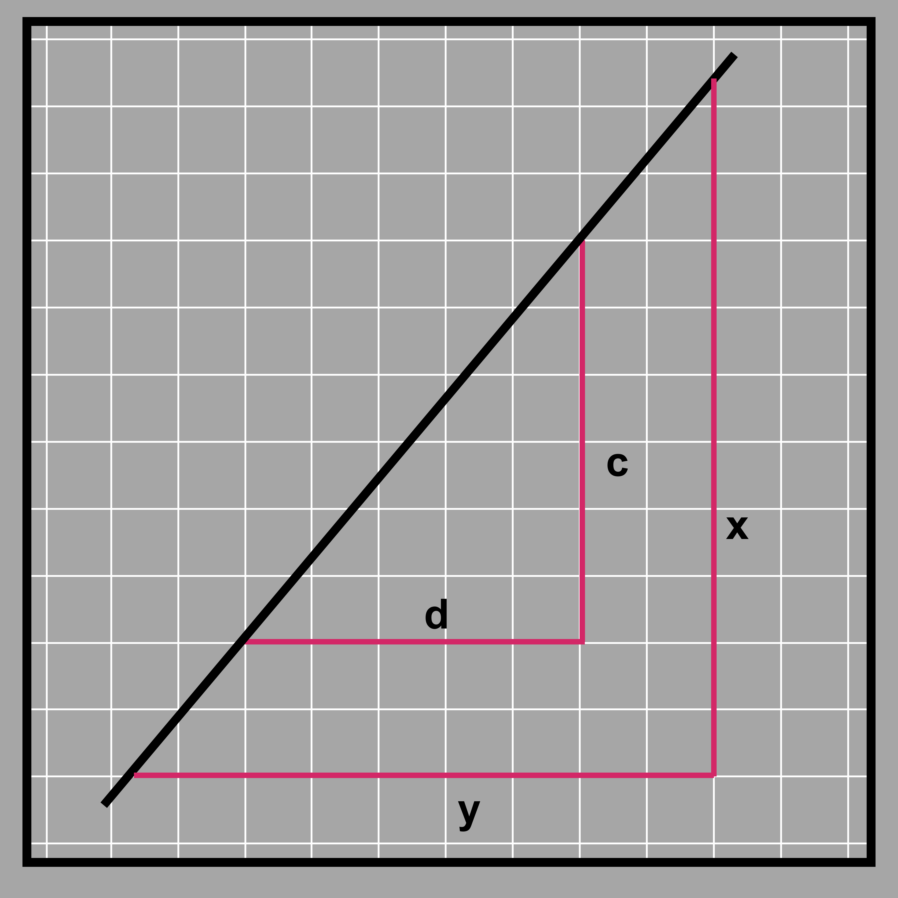

## Slope of a line using similarity

Since we are talking about the slope of a line, let’s start with a line and some triangles as shown. 

If we find the lengths of c and d from the image, c/d is equal to 6/5, which is equal to 1.2. In fact, no matter whichever two points you pick up from the black line, the ratio between the vertical and the horizontal sides that you extend from said points (forming a right-angled triangle) will be the same. Look at the lines x and y. Their ratio is 10.5/8.75, which gives us 1.2 as well. This is because any triangle formed in such a way is similar and in similar triangles, the ratio of the corresponding lines always have the same ratio! This ratio is known as the slope of the line. (Note that this is the same as the scale factor we learnt about in dilation and scaling. The vertical line is 1.2 times longer than the horizontal and it is the same for any vertical and horizontal lines we extend from the black line (as long as the two lines meet at a right angle).) This measure of vertical and horizontal lines extended from the line helps us find the inclination of the line and helps compare inclinations of different lines to see which is steeper. For example, take the two lines.

The pink line is much steeper than the blue line. We can say that because the vertical distance traveled is much more in the pink than in the blue with respect to the same horizontal displacement traveled.

For a distance of 5 units traveled in the horizontal distance, the pink line shows a horizontal distance of 8 units traveled, while the blue line only shows 3 units traveled. 

Let’s go into a little more depth here. The reference horizontal distance for comparing both the lines is taken as 4. The vertical distance in the case of the pink line is 8 and for the blue line, it is 3. The slope of the pink line is 8/4 = 2 (vertical/horizontal). The slope of the blue line is ¾ = 0.75. Since 2 > 0.75, the slope of the pink line is more than that of the blue line. So, while the slope does tell us about the inclination of a line, mathematically, it also tells us the distance traveled in the horizontal direction for a given vertical distance traveled. 

The slope of the line signifies a lot of information about the line. For example, a horizontal line has a slope of 0 because it moves no vertical distance when it moves a certain horizontal distance. 

On the other hand, a slope cannot be defined for a vertical line because it travels an infinite vertical distance when horizontal distance is zero!  

What if the line was inclined downward as shown below? 

Such a line will have a negative slope. You can find it the same way you find the slope of an upturned line like before but there will be a negative sign to signify the downward slope. That is because it drops some vertical distance when the line moves some horizontal distance (rather than an increase in the vertical distance).

We have learnt before that when there are two lines on a plane, they are either parallel or they intersect at one point. We can see their implication while studying slopes as well. Two lines are parallel if their slopes are the same. This means they travel the same vertical distance for a certain horizontal distance, which leads to them never meeting. Two lines intersect only when they have different slopes. This is because if one has a different vertical distance than another for the same horizontal distance, they are bound to meet at some point. 

Here, the blue and green lines given are parallel to each other. Similar triangles are formed by extending vertical and horizontal lines from the two lines (that meet at 90 degrees). 

You can see below that even though the triangle made by the parallel lines do not have the same size, the fact that they are similar ensures that the slope is the same, hence making them parallel. 

If the lines are drawn on a coordinate plane, we can use the coordinates to find the slope as well. Say we pick any two points on the line with coordinates (x1, y1) and (x2, y2). Then the slope of the line is: (y2 - y1)/(x2 - x1). You can see an illustration of why in the image below. Essentially, y2 - y1 is the vertical distance (one side of the triangle) and x2 - x1 is the horizontal (other side of the triangle)and devising them obviously gives us the slope.

