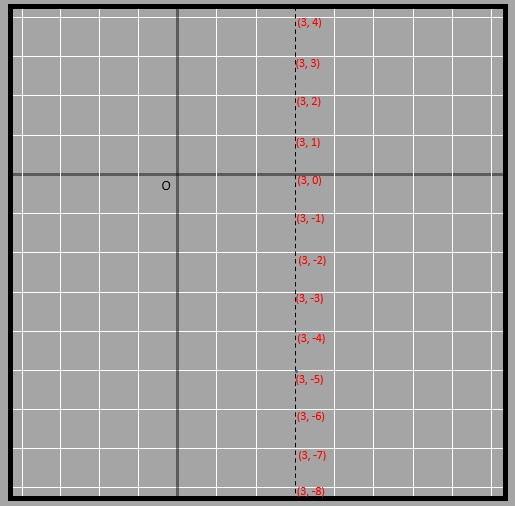

## Slope of a line using similarity
Let's start with a line.

9.22

We know that c/d would be equal to 6/5. As a matter of fact, no matter whichever two points you pick up from the black line, the ratio between the vertical and the horizontal sides (forming a right-angled triangle) will be the same. That ratio is known as the slope of the line. 
The measure of vertical and horizontal lines dropped from the line helps to find out the inclination between two lines. For example, take the two lines. 

9.23

The pink line is much steeper than the blue line. We can say that because the vertical distance traveled with respect to the same horizontal displacement is much more in the pink than in the blue.

9.24

Thus the slope of the pink line will be more than that of the blue line. 
The reference horizontal distance for comparing both the lines is taken as 4. The vertical distance in the case of the pink line is 8 and for the blue line, it is around 3
The slope of the pink line is 8/4=2
The slope of the blue line is 3/4=0.75
The slope of the line signifies a lot of information about the line. 
For example, a horizontal line has a slope of 0, because it moves no vertical distance when it moves a certain horizontal distance. Since there is no vertical distance, their y coordinate is constant for all points lying on it. 

9.25

A vertical line slope cannot be defined because it travels an infinite vertical distance while traveling 0 horizontal distance. Since there is no horizontal distance, their 𝑥 coordinate is constant for all points lying on it. 

9.26

A line will have a negative slope if it is heading downwards. That is because it drops some vertical distance when the line moves some horizontal distance. 

9.27

When two lines are compared, their paths are either parallel or intersecting. Lines are parallel when their slope is the same. It means they travel the same vertical distance for a certain horizontal distance. Lines intersect only when they rise at different rates in comparison to each other. Here the blue and green lines given are parallel to each other. 

9.29

Also, the triangles formed from parallel lines in the manner shown before are similar to each other. In the particular figure above, the red and purple parts make up two congruent triangles but even if the size is varied, the triangles formed will always be similar.

9.28

If any two points on the line are (x1, y1) and (x2, y2) then the slope of the line is:
(y2-y1)/(𝑥2-𝑥1)

9.30

A line contains multiple points on it. For constructing it, we know that we need at least two points but it doesn't provide the information on which other points it passes through. For example, a line that joins (1, 1) and (5, 5) also passes through (2, 2), (3,3), and so on to name a few. If we had to mention each point that a line passes through to just define it, then a page may not be enough. Sure enough, if we have graph paper then it's easier to show but when we don't have it, we have to list an infinite number of points. 
That is when the use of equations comes in. Equations help us to define all the points in a line without having to mention them individually.  For example, remember this horizontal dotted line from an earlier lesson. 

9.25
Here all of the coordinates that lie on the line have their y coordinate as 3. Thus the equation for this line is y=3. Simple!
Similarly, the vertical line has all of its points having the 𝑥-coordinate as 3. Thus the equation of the line is 𝑥=3. 

9.26

Not all lines are horizontal or vertical, How do we define the equation of the other types of lines?
In those cases, we take the help of slope. That is because the difference in the locations of any two points lying on the line is dependent on the slope which is the same throughout the line. Have a look at the blue line in the two figures. In the first figure when the horizontal distance is 4, the vertical distance is 4. But when a larger triangle is taken with 8 horizontal distance, the vertical distance also rises to 8 thus verifying that there will be a unit vertical distance rise for each horizontal distance. 

9.29

9.28
### Calculation of slope
Let's try to find the equation of a straight line plotted in the graph.

9.31
 
We can clearly see that the line passes through points like (1, 3), (2, 6), and (3, 9). The points beyond that aren't shown because the graph has limited space here. 

9.32

But can we get an idea of the points it will pass through beyond the area of the graph shown? Will (25, 100) lie on the graph?
When we analyze the different points shown in the graph,  we see that the y coordinate is 3 times that of the x coordinate. That means 3 is 3 times 1, 6 is 3 times 2, 9 is 3 times 3, and so on. 
Then is 100 equal to 3 times 25? The answer is no. So, (25, 100) doesn't lie on the line. We can check for any point using the same method, even the points of the 3rd quadrant. 
What about the equation of the line?
Since the y-coordinate is 3 times the x-coordinate, the equation for the line is y=3𝑥. Now whatever value we put in for 𝑥, we can find the y coordinate of the point that lies on the line. 
What about the slope of the line? 

9.33

The slope according to the triangle formed in the above figure is 3. Obviously!
Thus we understand that if the slope of a line passing through the origin is 'm', y=m𝑥 denotes its equation. 
What if the line doesn't pass through the origin?
Here is the same line that is 3 units down on the y-axis. The slope of the line is the same but is the y coordinate equal to 3 times the 𝑥 coordinate? The answer is no. 
3 times 1 is 3 but the first point has its y coordinate as 0. Similarly, 3 times 2 is 6 but the y coordinate is 3, and so on. 

9.34

9.37

Summarizing the table, 3 x 1 - 3 = 0
3 x 2 - 3 =3
3 x 3 - 3 =6
Since the line was pushed 3 units downwards, the y coordinate is 3 less than the 3 times the 𝑥 coordinate. 
That means 3𝑥 - 3 =y
The constant part (-3) that is in the equation is the point where the line meets the y-axis. If it meets the y-axis at the origin, the constant part's value will be 0. Just as in the earlier case of y=3𝑥. 
The same equation can be found by making right-angled triangles whose hypotenuse is on the given line.

9.35

The slope between any point on the line assumed as (𝑥, y) and (1, 0) should be the same as the rest of the line. 

9.36

y/(𝑥 - 1) = 3
or, y = 3 (𝑥 - 1)
or, y = 3𝑥 - 3
If we have an equation and need to find some points that lie on that line, then the objective is to find the pair of values in 𝑥 and y that will satisfy the given equation. So, we simply put an assumed value of 𝑥 to find out the corresponding value of y or vice versa. 
If the given equation is y=7𝑥 -9,
When 𝑥 =0, y= 7 x 0 - 9 = -9
So, (0, -9) is a point on the given line. 
When y = 5, 
we get, 
5 = 7𝑥 - 9
5+9 = 7𝑥
14 = 7𝑥
𝑥 = 14/7 = 2
So, (2, 5) is a point on the given line. 
