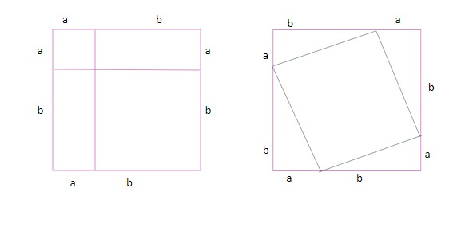

All triangles with right angles follow a law called the Pythagoras theorem. Let's see what it's all about.

Have a look at the two squares given; they both represent the square with the side length of a + b.

Since we have the same areas on both sides, we can equate them. The left square has two rectangles of area ab units and two squares of length a and b, respectively. The right square has another square inside that is tilted, along with four triangles each of area (½)ab. We suppose the length of the tilted square to be c, and thus the area of that square is c^2 units. 

When we equate the area on two sides, we get
a^2 + b^2 + 2ab = c^2 + 4 x (½)ab 
a^2 + b^2 = c^2

Now, if we just look at one of the triangles in case of the second image, what does this equation mean?

We can have a look at any right-angled triangle on the figure shown on the right, and we see that the square of the side opposite the right angle (c^2) is equal to the sum of squares of the remaining two sides (a^2 + b^2). This is true for all triangles that are right-angled triangles. 

We can also think of it this way.

If we have a right-angle triangle and we draw squares on all its sides, then the area of the square on the longest side (which is opposite the right angle) is equal to the sum of areas of squares on the other two sides. 

Inversely, we can also say that the triangle in which the square of one side is equal to the sum of squares of two sides will be a  right-angled triangle.

To make it easier, the side opposite the right angle is the hypotenuse, and the other two sides are the base and perpendicular of the triangle.

