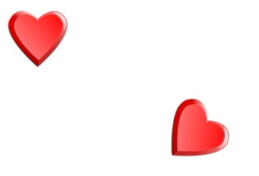

## What does it mean to transform objects?

Transforming objects means changing their orientation, location, or size for different purposes. There are two types of transformations: rigid and non-rigid. We will look at both of them to try to understand what they are and how they are different. 

## Rigid transformations

Rigid transformations are all about changing the position or orientation of an object. Think of moving a chess piece from one box to another and changing the position. We’ll look at more examples below.

Rigid Transformations keep the shape and size of an object the same, even after the transformation. The only thing that changes is the way the shape is facing (basically, its orientation). 

When two shapes are the same size and shape, we call them congruent. To figure out if two shapes are congruent, there needs to be a rigid transformation (or transformations) that can transform one shape into the other. And in reverse, if we can transform an object into an image using one or more rigid transformations, then the object and image are congruent! 

There are three types of rigid transformations: reflection, rotation, and translation.
 
Check out the examples below to see how these work in real life. 
 

The building has its image ‘reflected’ in the water as seen in the photograph. The object (building) did not change its shape or size, just the orientation.

The heart-shaped object is ‘rotated’ to get the new orientation.

The queen chess piece is being moved (translated) on the board. 
We will learn more about reflection, rotation, translation, and dilation going further.

