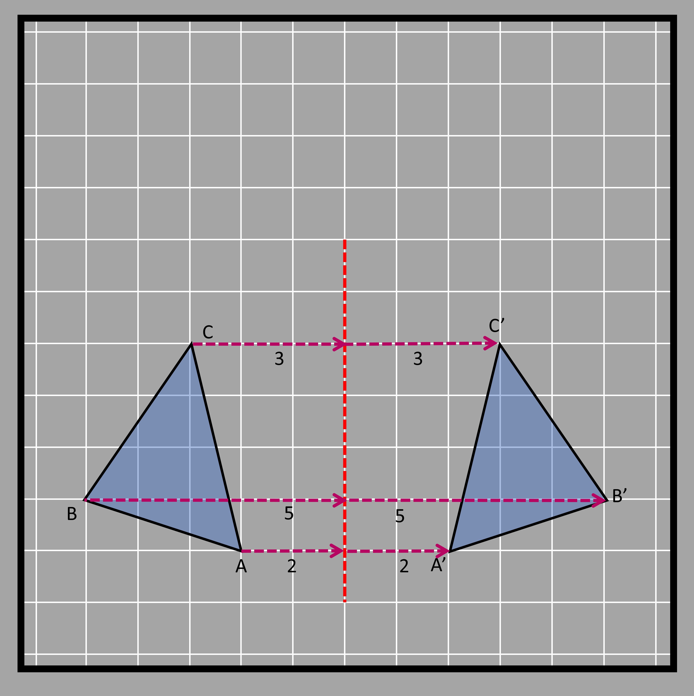
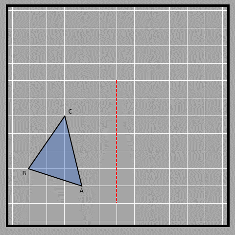
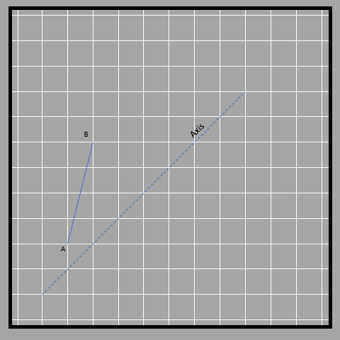
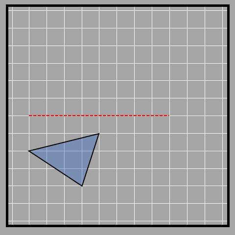
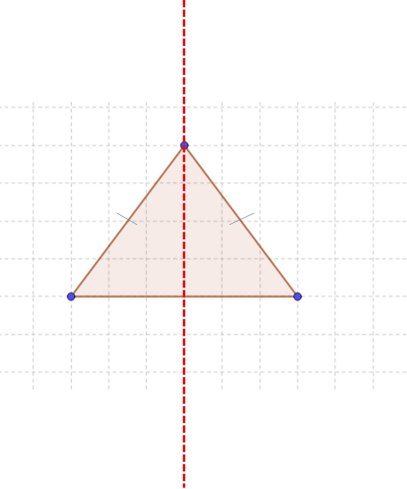
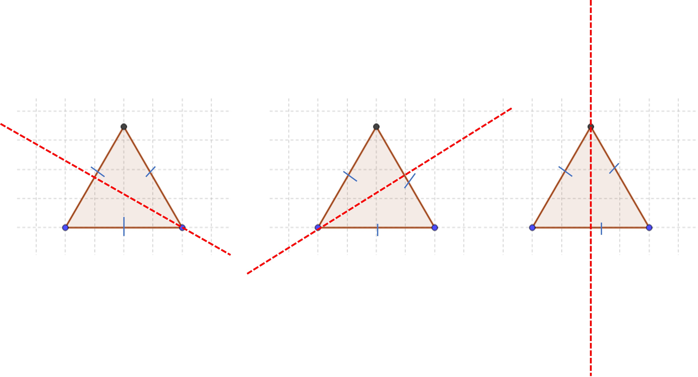
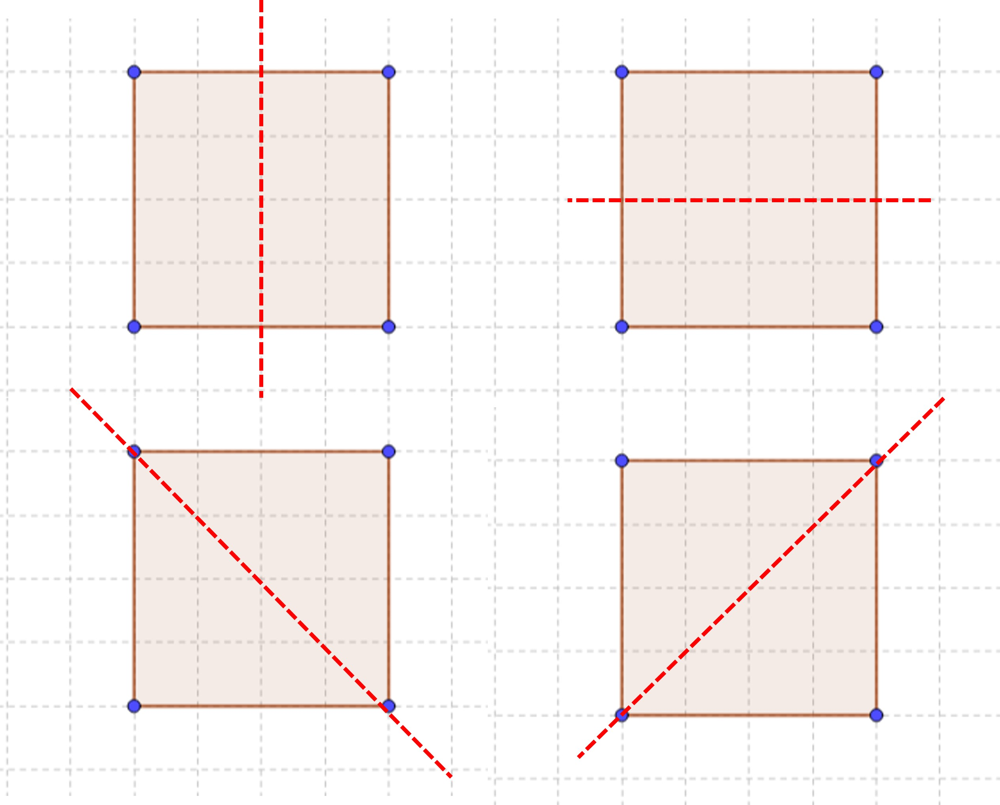
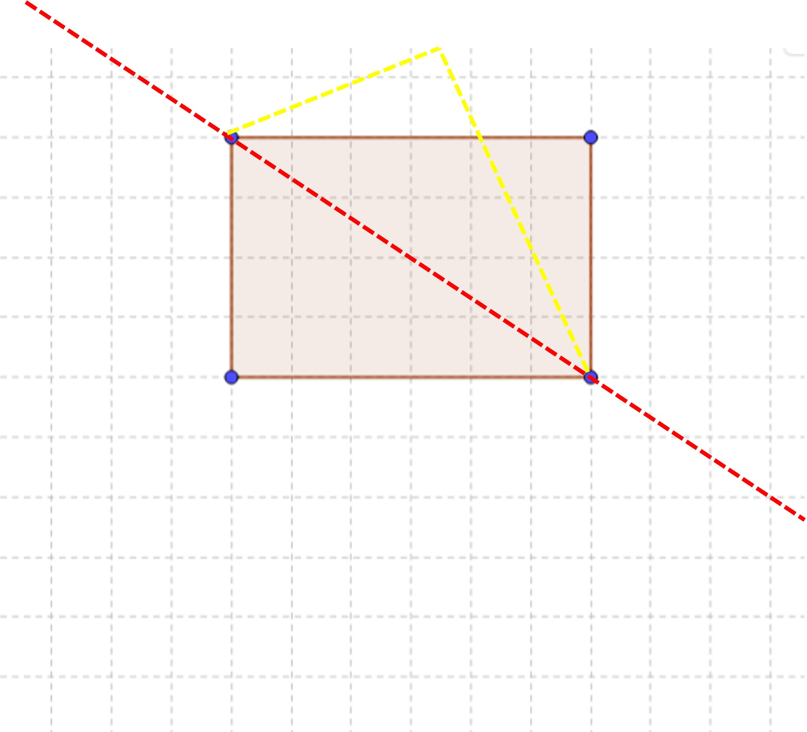
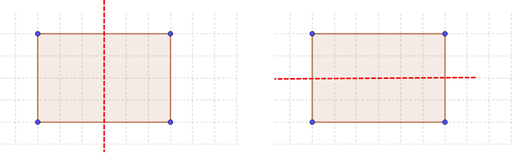
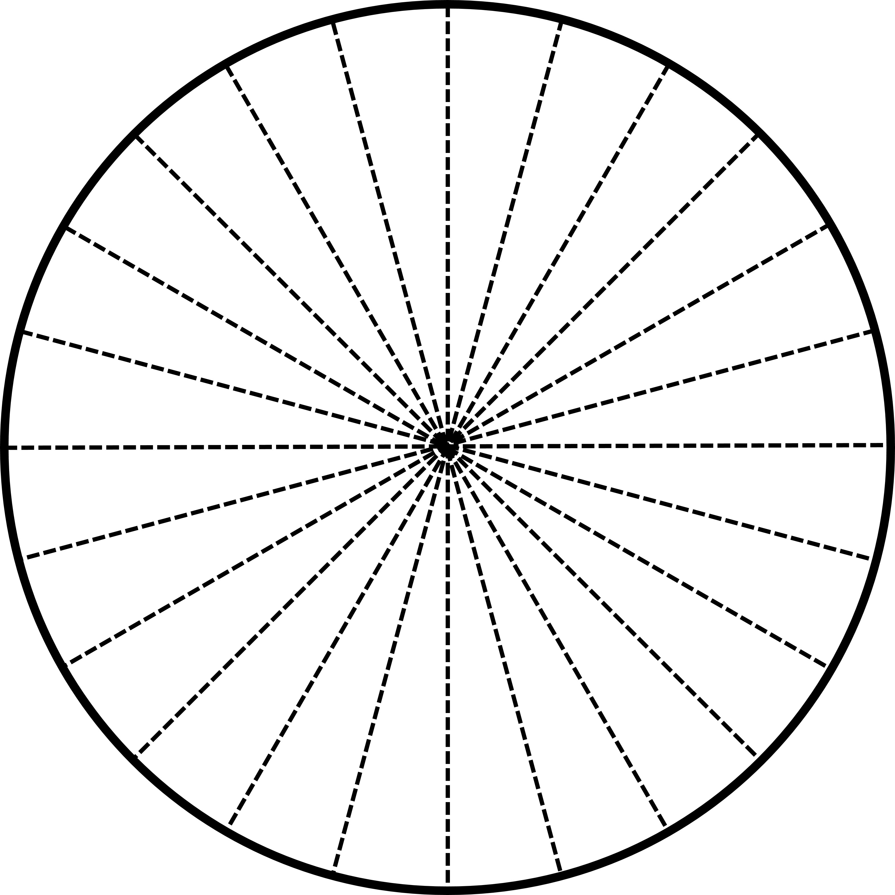

## What is reflection?

Have you ever looked at yourself in the mirror and noticed that your reflection looks like you, but everything is flipped around? This is because when you look in the mirror, the things on your right side seem to be on the left, and the things on your left side seem to be on the right. This is called a reflection or an image of yourself. The other thing that can be noticed is that when you are near the mirror, your image also seems near and when you are far from the mirror, your image also seems far from the mirror. This is one type of rigid transformation used in geometry. Being a rigid transformation, it means that the shape doesn't change, but it's just moved or flipped around. 

When we reflect a shape, we need to use a specific line called the axis of reflection. This line tells us about the new image’s orientations and distance from the original object. Think of this as the mirror in our earlier example.
Let's see this through an example. First, we make the triangle ABC. Then, we choose the vertical axis as the axis of reflection. We start by making point A', which is the reflected point of A. A' should be the same distance away from the axis of reflection as A is, which is 2 units in this case. We can draw a line from A to the axis which is perpendicular to the axis, which helps us draw a line from the axis to A’, which also needs to be perpendicular to the axis. We do the same thing for points B and C to get B' and C'.

Here is an animation that shows us the reflection of triangle ABC.

Think of looking at a mirror and observing that you and your reflection are equal distances from the mirror. This is the same thing! We use labels on diagrams to tell the difference between objects and their reflections. When we label an image, we put a dash on the letter. For example, the reflected point of A is labeled as A’. Check out these images to see how objects and their reflections look on different reflection axes (other than vertical that we saw before). What do you think? 

In this case, the axis is slanted, which makes it a bit trickier to measure, but the distance of different points (A and B) from the axis is the same as that of the points on the image (A’ and B’). We have to measure the distance diagonally, and the lines connecting the object and its image to the axis are perpendicular. The lines in red and yellow connect the object and its image, while the blue line is the axis.

Here’s one more example.

We clearly see that the axis of reflection (red line) affects how the image of the object is reflected. If the object is close to the axis, the reflection will be close too. If it's far away, the reflection will be far away too. Kinda repetitive, right? But it's a necessity since it’s so important.

## Symmetry by reflection

Reflections can also help us understand the idea of symmetry. An object is symmetric if it can be divided into two identical parts. The axis of reflection can help us find the line of symmetry. For example, take an isosceles triangle. If we fold the left part along the line of symmetry, it will match up perfectly with the right part. This is because the left part is just a reflection of the right part, and vice versa, and the line of symmetry is the axis of reflection. Pretty cool, right?

The idea of line symmetry can help us understand 2D objects better. Every object has a different number of lines of symmetry, which are like imaginary lines that divide the object into two identical halves. For example, an equilateral triangle has three lines of symmetry, which means you can draw three lines that divide the triangle into two equal parts. Don't you think that's pretty neat?

Likewise, a square has four lines of symmetry as seen below. However, the same cannot be said about rectangles. The two lines of symmetry on the bottom two figures cannot be observed in a rectangle.

Let’s see what happens with a rectangle if we fold it in half along the diagonal. The bottom part does not completely overlap with the top. You can test this out with a rectangular sheet of paper and fold it through the diagonal line.

Thus, a rectangle only has two lines of symmetry; the horizontal and the vertical.

The circle has an infinite number of symmetric lines. 12 of them are shown in the figure. Folding the circle along any of these lines will overlap the two halves completely.

