## What is rotation?

Have you ever turned an object? Well, that's just what rotation is! It means changing the way an object is facing by turning it at a certain angle around a fixed point.

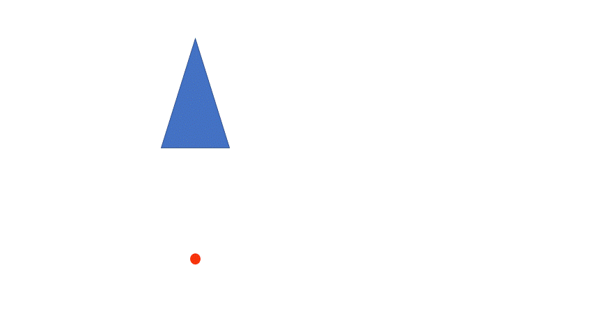

The fixed point is needed because the rotation has to have a certain point to rotate on. Do you notice how the door knob is rotated to open the door?

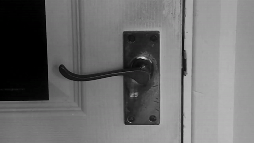
Notice how the doorknob rotates around a fixed point? That point is called the center of rotation. When we rotate something, we measure how far it turned in degrees along with the direction of displacement (direction of rotation). For example, a doorknob might turn 90 degrees, or one-quarter of a full turn. But which way did it turn? We call the direction opposite to a clock's movement "anticlockwise." For convention, we say that anticlockwise turns are positive and clockwise turns are negative. These angles are inverses of each other. For instance, turning 60 degrees clockwise is the same as turning 300 degrees anticlockwise. The object reaches the same point in both cases.  We write 60 degrees clockwise as -60 degrees and 300 degrees anticlockwise as 300 degrees. That's why a 300-degree rotation and a -60-degree rotation look the same. 

Similarly, if you turn an object 45 degrees clockwise, that's the same as turning it 315 degrees anticlockwise. So, -45 degrees is the same as +315 degrees. Check out the picture below to see what we mean!

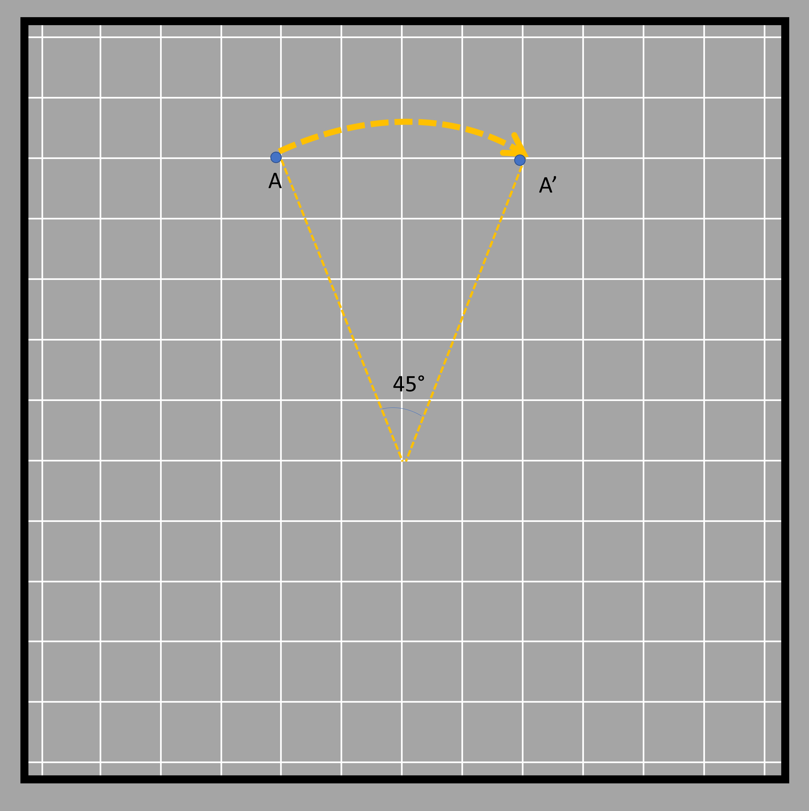

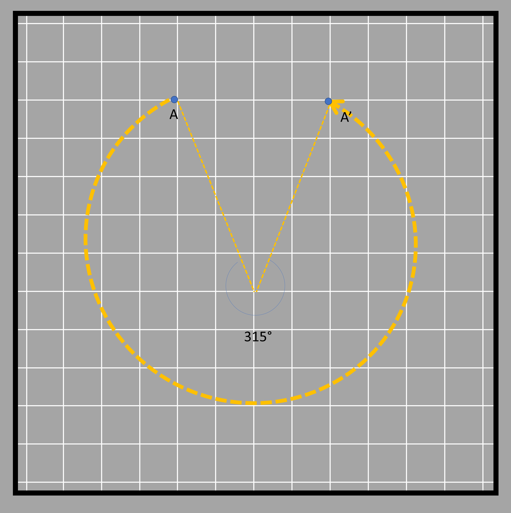

This phenomenon applies for two degrees of rotation whose values when added give 360° degrees (without the sign!). Go back and add the two inverse rotation degrees and see if you get a sum of 360 or not. One such example is shown in the figure below where the arrow pointed toward the top rotates and points toward the right when rotated clockwise 90° degrees. That same shape can be obtained when it is rotated 270° degrees in the opposite direction, which is an anticlockwise direction. Here the center of rotation is shown in the middle.

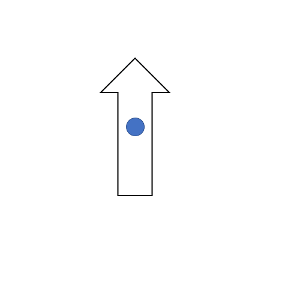

Here are some objects being rotated. We have a triangle ABC that is rotated - 45° degrees (clockwise) about the center X (center of rotation). The rotation angle is shown for point A only.

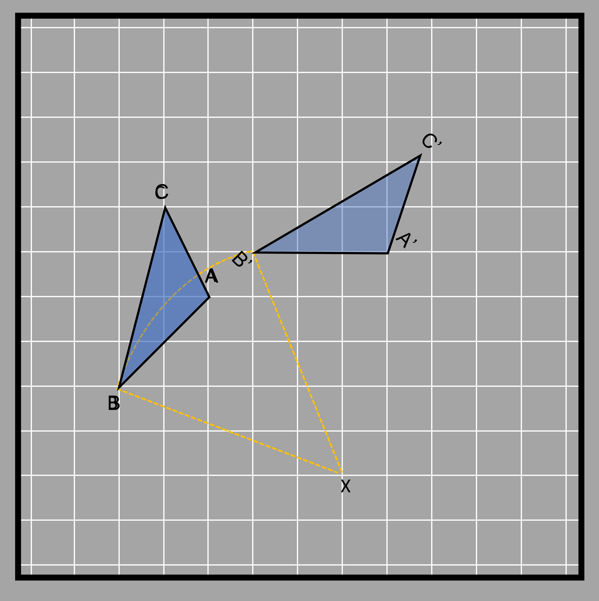

Each of the three points and their rotation is shown in different colors in the following figure. All of the rotations measure 45° degrees clockwise from the line joining the point to be rotated and the center of rotation (BX, AX, and CX). 

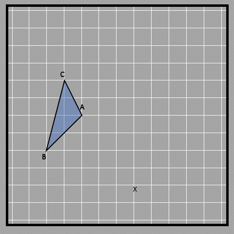

The rotation makes an arc in all three cases, with the center of rotation as the center of different circles (as denoted by the three colors below). The center of rotation is the point where all radii of the arc meet, which are the lines from the initial point and the lines from the rotated point (BX, AX, CX, B’X, A’X, and C’X). You can clearly see this below.

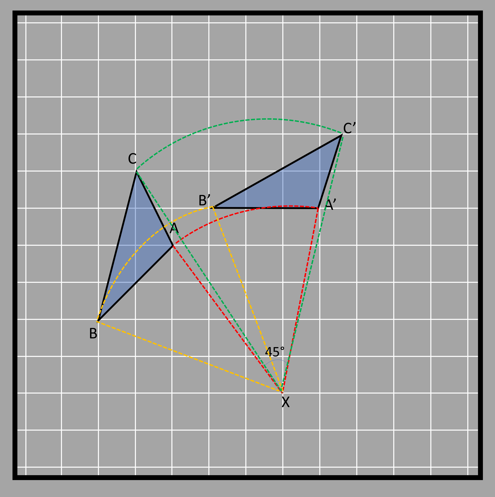

Another example of rotation is shown below. The arrow in the arcs gives the direction of rotation. In the examples below, the direction of rotation is clockwise. 

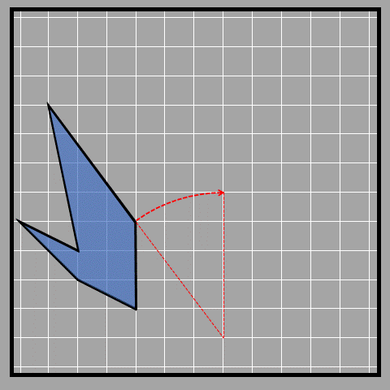

## Symmetry by rotation

Like with reflection, we can use rotation to explain a type of symmetry present in 2D shapes. Let’s see what it actually is and how this type of symmetry is different from reflective symmetry. A full circle is 360° degrees, and if we rotate a shape 360° degrees around its center, it will end up in the same position it started in. This means that the new image is symmetrical to the original shape. That means it has rotational symmetry! It's different from reflective symmetry, which is when a shape can be folded in half and the two sides match.

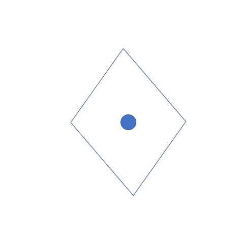

When an object rotates about its center and the image looks the same as the original, then the object has rotational symmetry. All objects have at least one rotational symmetry since one full circle always gives us the same image. But there are certain shapes that return to their original position prior to completing the 360° degrees rotation. For example, a square gets to its initial position (or the initial and rotation images look the same) at 90° degrees, 180° degrees, 270° degrees, and ultimately 360° degrees. This tells us that a square has four rotational symmetries.

A rectangle gets to its original position at 180° and 360° degrees only. Thus, a rectangle only has 2 rotational symmetries.

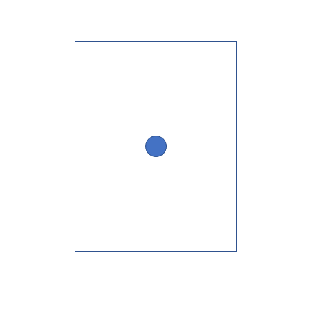

