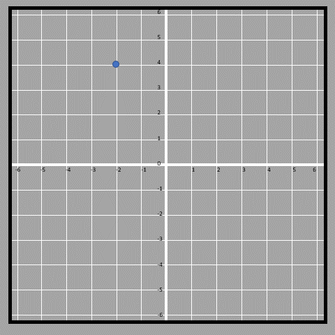
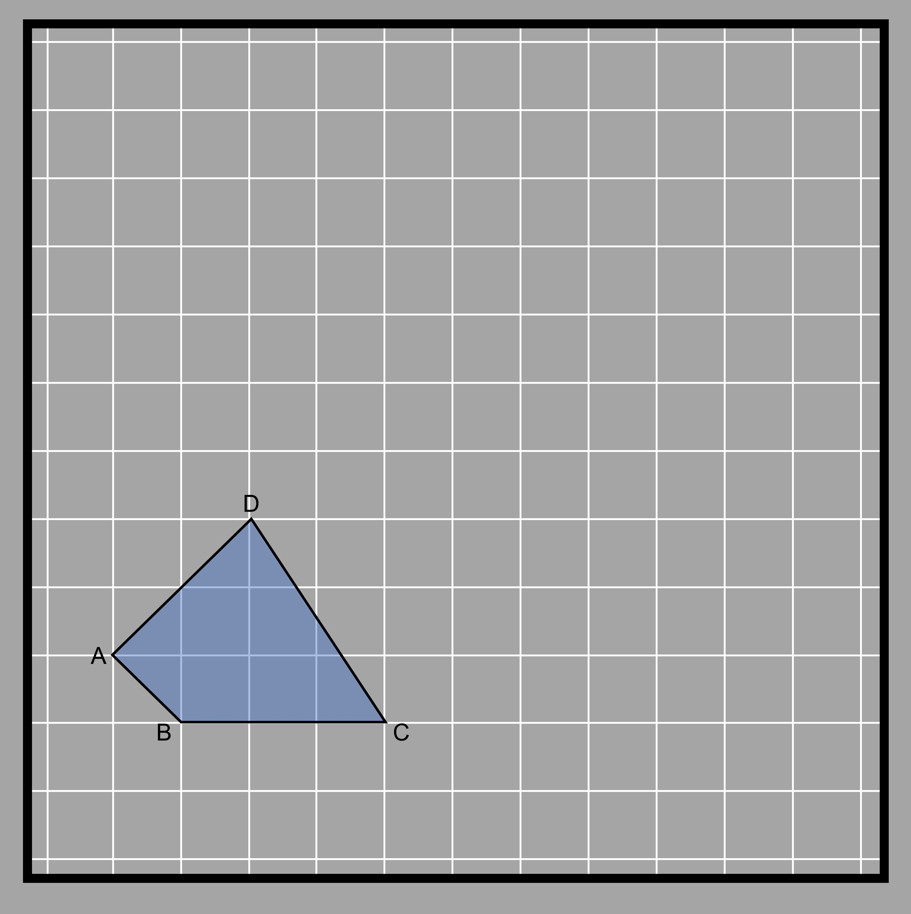
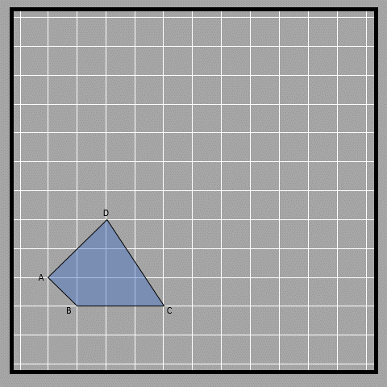

Translation
The translation is also known as sliding, which involves the process of changing the location of the object.
Normally, this is done by denoting the horizontal displacement and the vertical displacement.  This is generally denoted by a pair of numbers. The sign convention of the direction works in the same way as the cartesian plane does. If a direction is represented by (2, -3) then it means 2 positions to the right and 3 positions downwards. An object transformed by the pair will shift in that direction. 

Point translated 2 units to the right and 3 units to the downs to the down.

8.27

In translation, the orientation of the object remains the same, unlike the other two types of rigid transformations (rotation and reflection). It's just like picking up an object from one point and placing it on another point. Some of the examples of translations are shown in the figure.
Here is a quadrilateral ABCD and it has to be translated 3 units to the right and 3 units upwards. 

8.28 8.29

Another example here shown is a triangle that is translated 3 units to the right and 2 units downwards (hence shown as (3,-2)). Horizontal displacement in the left direction and vertical displacement downwards are written with negative signs. This same convention applies while plotting coordinates as well. 

8.30

