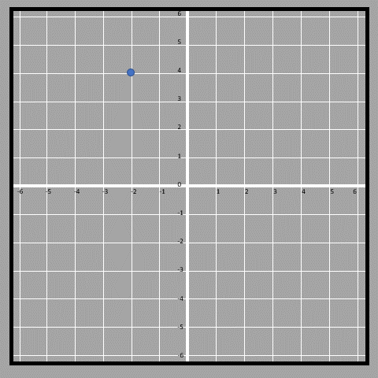
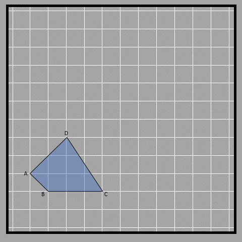

## What is translation?

When we ‘translate’ an object, we slide it to a new spot. We use two numbers to show how far it moves left or right (horizontal) and up or down (vertical). The sign convention of the direction works in the same way as the cartesian plane does. So if we say (2, -3), it means the object moves 2 spots to the right and 3 spots down. The object will end up in its new spot after the slide. You can see this in the image below. 

When we translate something, we don't change the way it's facing (the orientation) like we do with rotations and reflections. It's like picking up a toy car and moving it to a different spot. Look at this picture of a shape called a quadrilateral. We want to move it 3 units to the right and 3 units up (3, 3). 

Another example shown is a triangle that is translated 3 units to the right and 2 units downwards (hence shown as (3, -2)). 

If horizontal displacement is in the left direction and vertical displacement is downwards, then they are written with negative signs (-x, -y). This same convention applies while plotting coordinates as well.

