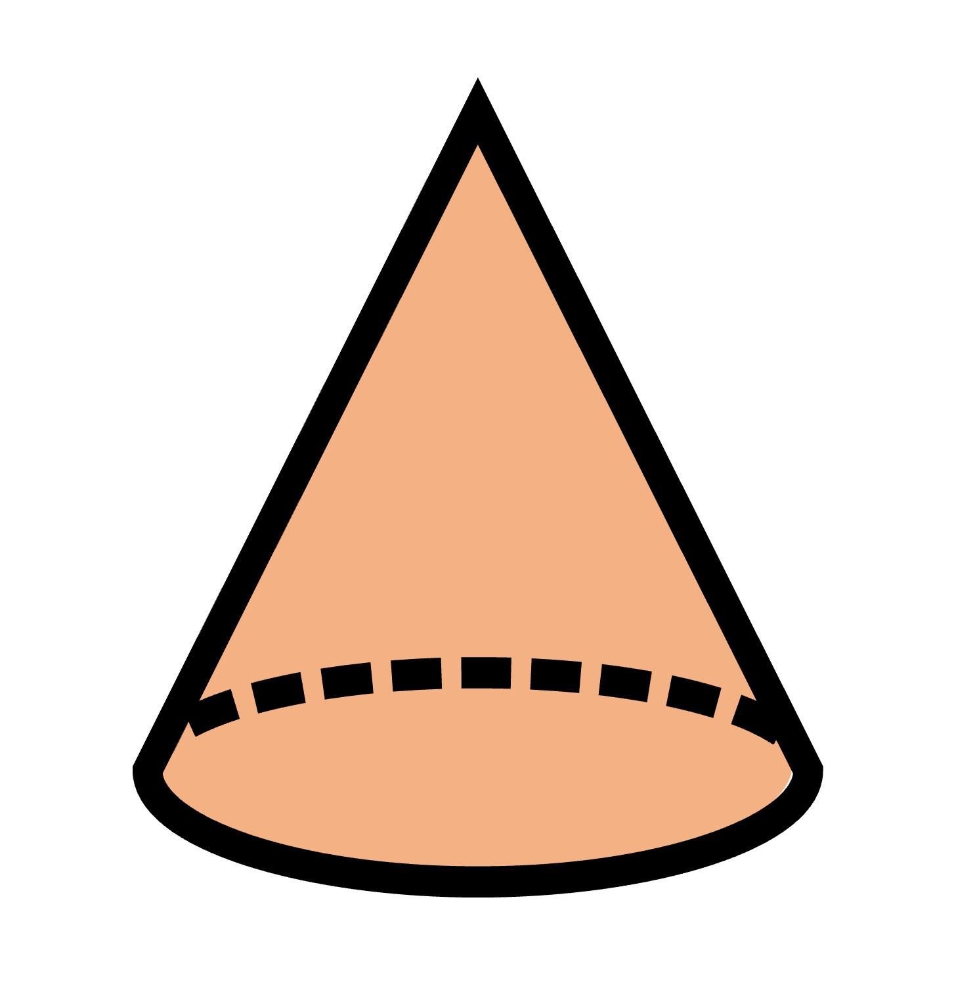
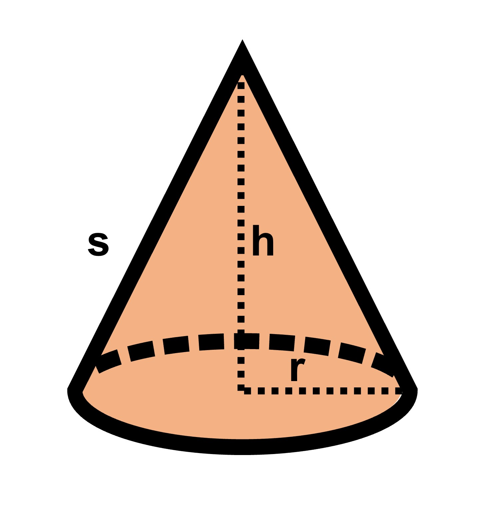
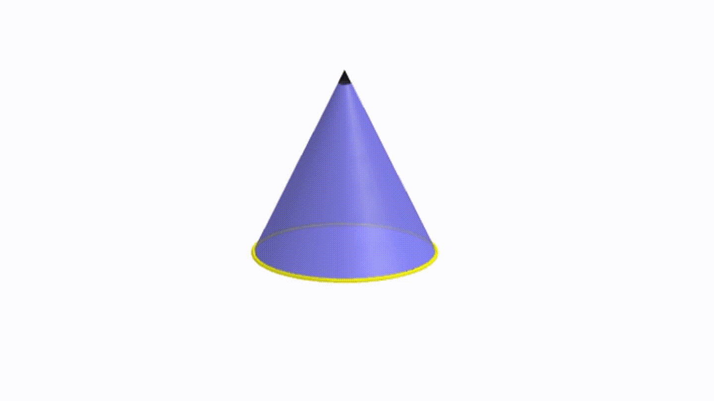
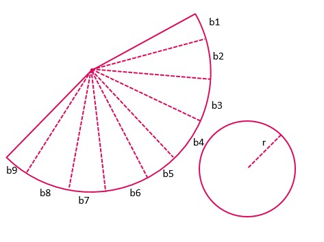
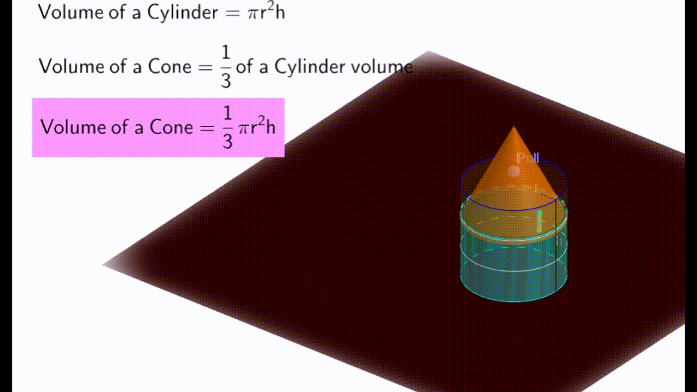

After cylinders, let's talk about cones. They're like the pyramid version of a prism. Basically, a cone is to the cylinder as a pyramid is to a prism. The bottom of a cone, instead of being a square or pentagon (or other shapes with sides), is a circle, but as you go up, the circle gets smaller until it reaches the top. 

 
The height of the cone is the distance from the center of the base to the highest point (like with a pyramid). And the distance from the edge of the circle to the top point is called the slant height. It's like measuring along the slanted side of the cone. Always remember that the slant height and the actual perpendicular heist are two different things (like in a pyramid, yet again!). 

When we open the curved surface, we get the shape shown in the figure. This is the net diagram for a cone.

### Surface Area of Cone

To find the surface area of a cone, we try a similar method to that of a cylinder, by opening the cone and getting the net diagram.
The curved part of the cone we get after we open the cone can actually be divided into small triangles, where the base of the curved part or the arc-shaped part is the base of the triangle. The heights of all these triangles are equal to the slant length (l) of the cone. This should be obvious since we are dividing the curved part into triangles. 

Now, if we make a lot of these divisions, the curved part will start to look straight, like in a triangle. 
Let's call the bases of all these triangles b1, b2, b3, b4, b5, ……….. up to n parts. 
To find the area of one of these triangles, we use the formula: Area = ½ x base x height. 
And if we add up the area of all the triangles, we get: Area of all triangles = (½ x b1 x l) + (½ x b2 x l) + …… + (½ x bn x l). 
But, we can simplify this even further! We can take ½ x l common from all terms, leaving us with the sum of bases as one term. We also know that the sum of all the bases must be equal to the circumference of the base circle. We can write this as: b1 + b2 + b3 + b4 + …… + bn = 2πr. 
So, the area of all the triangles can be written as:
Area of all triangles = ½ x (b1+b2+b3+b4+……+bn) x l = ½ x 2πr x l = πrl
It should not come as a surprise that this is also equal to the curved surface area of the cone. 
In a cone, we also have to consider the flat circle at the bottom of the cone, which has an area of πr^2. So, the total surface area of the cone is: Total surface area = πrl + πr^2 = πr (l + r). Unlike a cylinder, we do not need to take into account two circular bases, since obviously, we have just one base.

### Volume of cone

When you look at a cone and cylinder with the same height and circular base, do you ever wonder how their volumes would compare with each other? Maybe the volume of the cone is about half the volume of the cylinder?  
It turns out that the volume of a cone is exactly one-third of the volume of the cylinder! You can actually test this out by taking a cone and a cylinder with the same base area and height. If you fill the cone with liquid and then pour it into the cylinder, you'll need to do it three times to fill the cylinder up to the top. Don't you think that's pretty neat?

Take a look at the picture above. Do you see the cylinder with liquid inside? The liquid is only 2/3 of the cylinder's actual height. But when a cone with the same height as the cylinder is dropped in, the liquid fills up to the top! So, we can figure out the volume of the cylinder by using this equation: 

Volume of cylinder - 2/3 of volume of cylinder = volume of cone. 

Or, in other words, [1-(2/3)] of volume of cylinder = volume of cone. 

Volume of the cone =  ⅓ πr^2h. 

