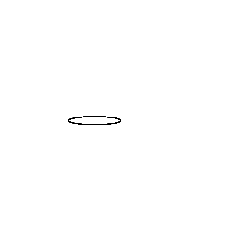
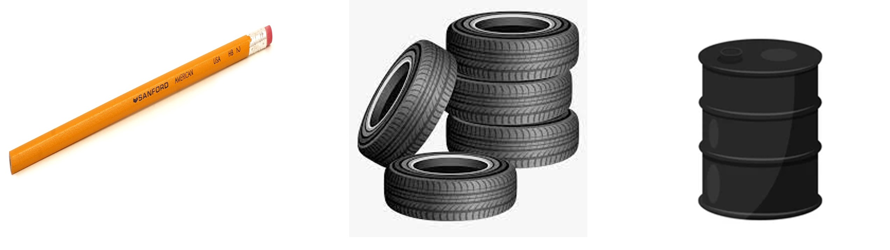
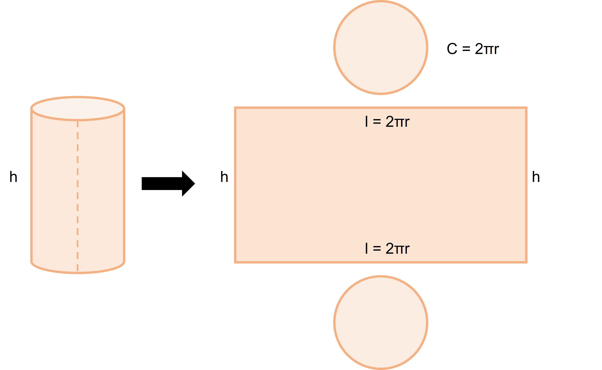

Let’s refresh what we learned about polyhedra in 7th grade. We learned that polyhedra are objects with flat surfaces like cubes, cuboids, and pyramids. But what about non-polyhedra objects? These are objects with curved surfaces like cylinders, cones, and spheres. 

Let's take a closer look at cylinders. Cylinders are formed by stacking circles of the same size on top of each other or by rolling up a rectangle and joining the ends together. 
 

If the surfaces of the cylinder are spread out then we get something like shown below. This makes sense since we just said that rolling up a rectangle gives us a cylinder. If you remember what we learned about net diagrams, this is the net diagram of a cylinder. 

Having observed the figure above, which real-life objects do you think match this shape? An unsharpened pencil is one such object, oil drums or tanks are another such object. Tires are also cylindrical, or more specifically hollow cylinders (think of hollow as nothing being inside).

### Volume of Cylinder

Remember when we talked about prisms and how we found the volume by multiplying the base area by the height? Well, we can use that same method for cylinders too! (Even though cylinders are not exactly prisms!) The only difference is that the base of a cylinder is a circle, so we need to multiply the height by the area of the circle, which is πr^2. So, the formula for finding the volume of a cylinder is: Volume =  Base area x height = πr^2 x h. 

### Surface Area of cylinder

Now, finding the surface area of a cylinder is a little trickier than finding the volume. With prisms (or other polyhedra), it was easy because all of the shapes were flat and we could easily find the area of the flat 2D objects. But with a cylinder, while the two bases are flat circles, a curved surface joins the two circles. What we can do is cut the curved surface in a way that is parallel to the axis. This gives us a rectangle and two circles at the two ends. Look at the images below of how we could cut the cylinder. 

Here, the length of a rectangle is equal to the circumference of the circle at the base of a cylinder. Can you see that from the image?

The width of the rectangle is the same as the height of the cylinder. Cool, right? So, we can use this information to find the total surface area of a cylinder. All we have to do is use the formulas we learned before to find the area of the rectangle and the two circles that make up the cylinder. 

To find just the curved surface area (which is the area of the curved part), we can simply use the area of the rectangle, which is l x b = 2πr x h = 2πrh. 

The total surface area is the area of the curved part (the rectangle) and the two circles. 

Total surface area = Area of two circles + Area of the rectangle = πr^2 + πr^2 + (2πr x h) = 2πr^2 + 2πrh = 2πr (r + h)
