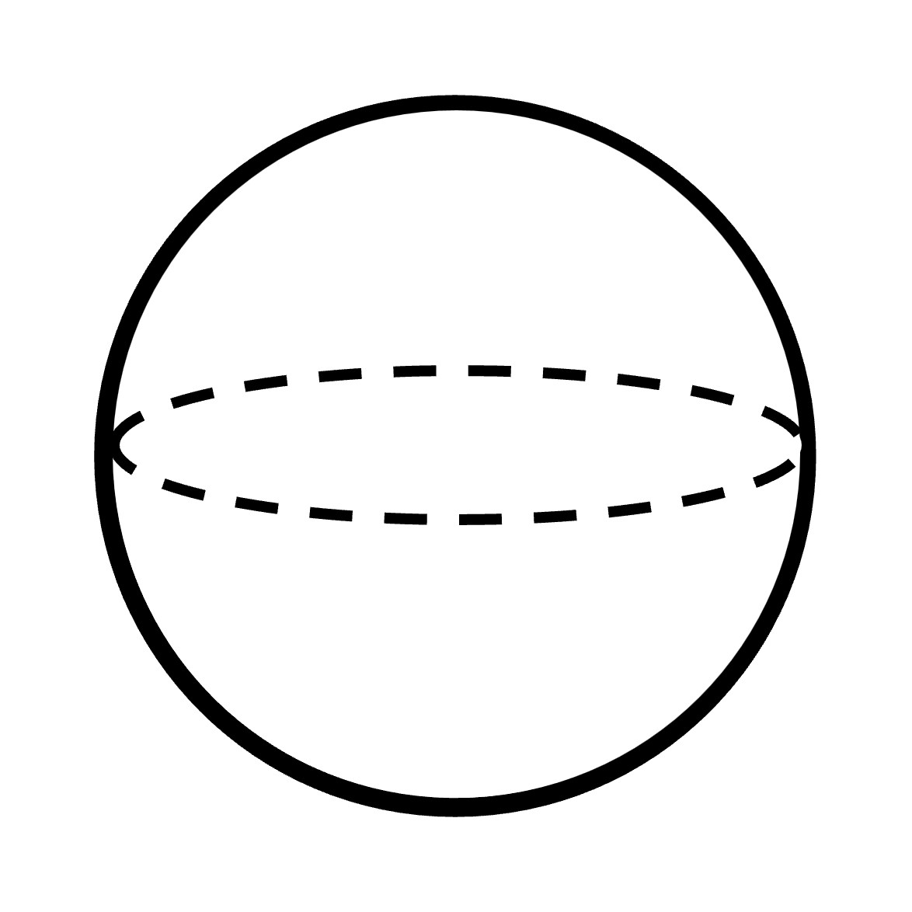
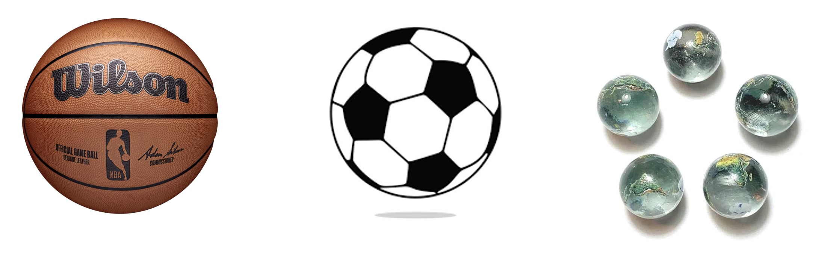
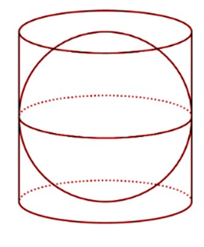
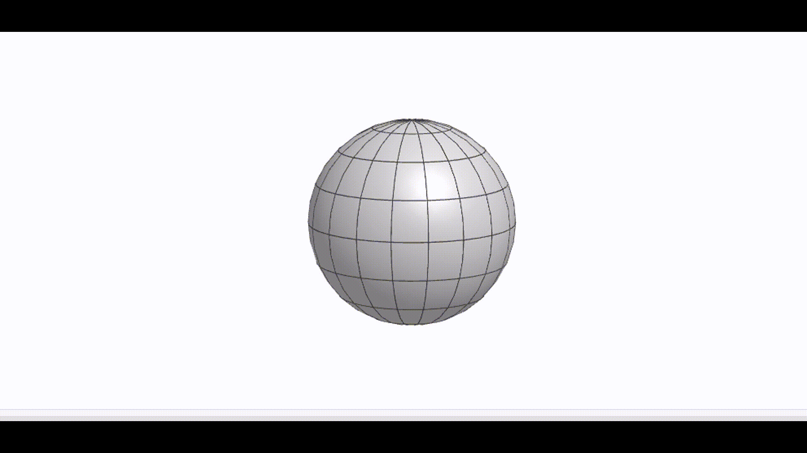
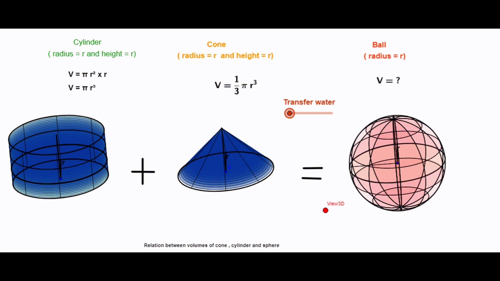

Besides the cylinder and cone, another type of 3D object with a curved surface is a sphere. The difference between the former two and the latter is that the sphere does not have any flat face at all.

Observing the above image of a sphere, what objects can you think of that look like it? Sports balls like basketballs, footballs, and volleyballs are all spherical, which means they have the same shape as a sphere. 

 
### Surface area of Sphere

Let’s talk about the surface area of a sphere. To measure it, we use a cylinder that has the same dimensions as the sphere. That means the cylinder has the same height as the sphere's diameter, and the base of the cylinder and sphere have the same diameter too. The sphere fits perfectly inside the cylinder, like a puzzle piece. But wait, the cylinder is hollow, with no tops or bottoms!

It is found that the cylinder completely covers the upper and lower surfaces of the sphere. This means that the curved surface area of the cylinder is equal to the total surface of the sphere.

Note that a sphere does not have a curved surface area and total surface area distinction, since a sphere only has curved surface (unlike a cone and cylinder).

So, let’s find the lateral surface area of the cylinder, which will give us the total surface area of the sphere. 
Lateral surface area of the cylinder = 2πrh = 2πr x 2r = 4πr^2 [Height of cylinder is the same as the diameter of the sphere, 2r] 
This is the total surface area of the sphere.

### Volume of Sphere

Let's now move on to finding the volume of a sphere. First, we need to find a cone that has the same height and radius as the cylinder we used before (to find the surface area of the sphere). We fill the cone and cylinder with a liquid and pour it onto the sphere (with the same radius as the radius of the bases of the former two). If the liquid fits perfectly inside the sphere, then we know that the volume of the cone and cylinder combined is the same as the volume of the sphere. Interesting, right?

So, the volume of the cylinder + volume of the cone = Volume of the sphere 
or, Volume of sphere =  πr^2 x r + (⅓) x πr^2 x r = (4/3) x πr^3

