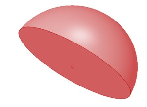
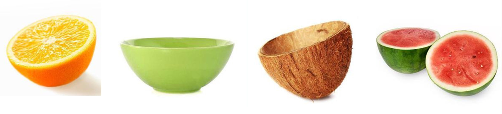

Have you ever cut a ball in half? If you have, then you've seen a hemisphere! A hemisphere is half of a sphere. 

You can find hemispheres in lots of things. For example, have you ever cut a lemon, coconut, or watermelon in half? Those are all hemispheres! Even bowls are hemispherical. But, there's one big difference between a bowl and a lemon. A bowl is hollow because it has space inside, while a lemon is solid because there's no space inside. 

### Volume of Hemisphere

Since the hemisphere is literally a sphere cut in half, it has a volume of exactly half of the sphere. 
Volume of hemisphere = [(4/3) x πr^3]/2 = (2/3) x πr^3 

### Surface area of Hemisphere

Just like with volume, when you cut a sphere in half, half of the surface area is still present. This time though, we have a curved part and a flat part as well. So, half the surface area of the sphere would be the curved (lateral) or total surface area of the hemisphere?

The curved surface of the hemisphere is the same as half of the surface area of the sphere, so we can find it by taking the total surface area of the sphere and dividing it by 2. 
This gives us the formula: 
Lateral surface area of hemisphere = total surface area of sphere/2 = (4πr^2)/2 = 2πr^2. 

But in case of the total surface area, remember that we need to add the flat part created due to the sphere being cut in half.  
This circular base has the same radius as the hemisphere. So, to find the total surface area of the hemisphere, we add the lateral surface area and the area of the base circle. 
This gives us the formula: 
Total surface area of hemisphere = lateral surface area of hemisphere + area of base circle = 2πr^2 + πr^2 = 3πr^2. 
