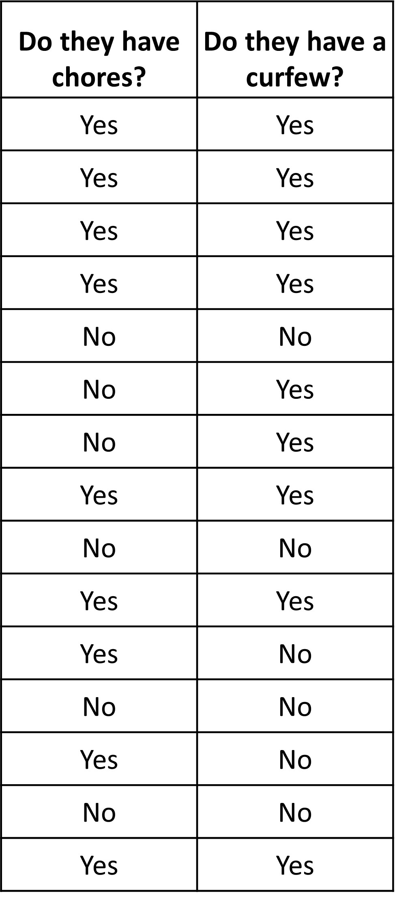
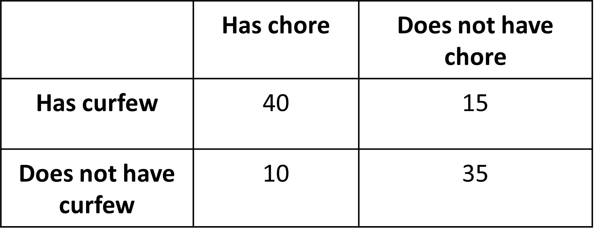
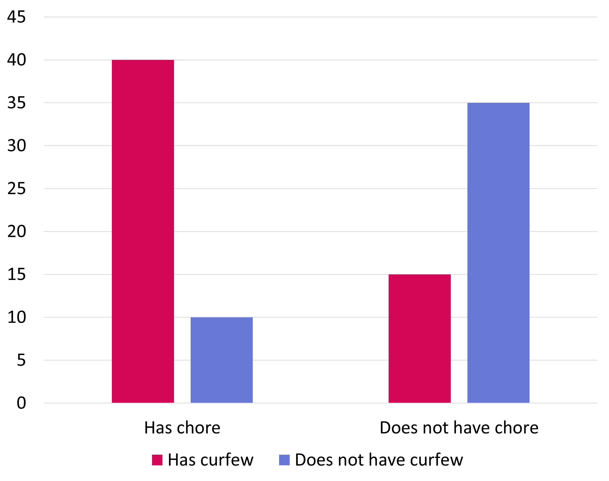

We are already familiar with categorical data. It is simply data in the form of categories. For example,  what color is everyone’s favorite in a classroom? The answers could be red, green, yellow, black, etc. If we had counted the number of people who liked different colors, we would get numerical data. 

Like how we dealt with numerical bivariate data, we can also find association between categorical bivariate data. Let’s use an example to see how that can be done. 

There are two variables we will be looking at for 100 students in c school. Do they have chores at home assigned to them (like cleaning their room, washing dishes after meals) and do they have some sort of a curfew at time (at 9 pm or 10 pm). 

Following is the table with the data for the above questions, but since it is difficult to have 100 rows, only about 15 are shown. 

It simply contains yes or no data. Looking at the table, we know that we can have four types of answers from this data. 
1. Students who have curfew and who have chores
2. Students who have curfew, but no chores
3. Students who do not have curfew, but have chores
4. Students who have no curfew and no chores

We can arrange the data given in the above table in another form of table with the four types of data we discussed just now. For this, curfew data can be shown row wise and chore data can be shown column wise. 

We see that we have the frequencies for the four types of data we discussed earlier. 

Let’s say we want to see if there is an association between people who have chores and people who have curfews. We want to see if students who have a curfew also tend to have chores or not. Let’s show the frequencies of the students in the different categories in a bar graph. 

We see that the number of students who have chores is slightly higher than those who do not have chores. We also see that out of the people who have chores, more students also have curfew. Out of the students who do have chores, more students also do not have a curfew. So, does this mean that having a curfew causes students to have chores at home? Probably not, it sounds absurd. But we can see some sort of association between the two, mostly a positive one between having a chore and having curfew.  

This is how we look for association between categorical bivariate data. 
