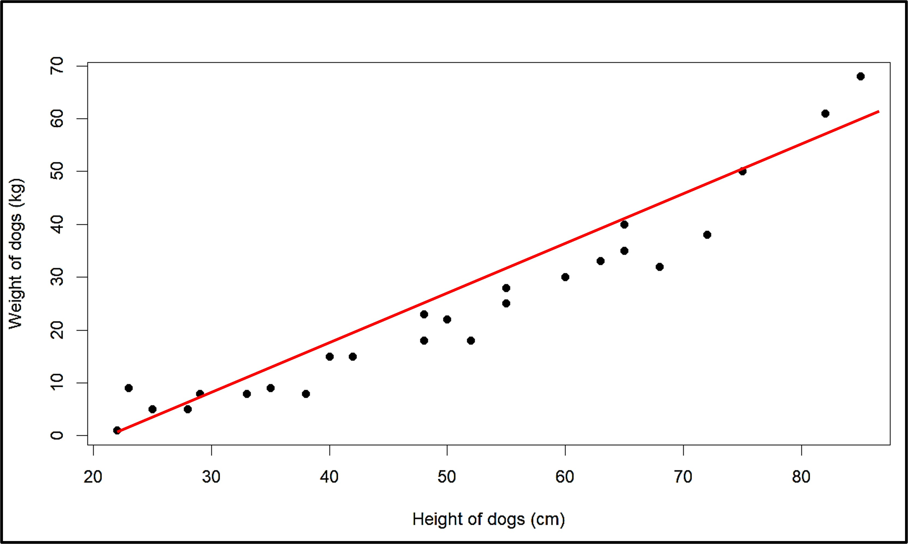
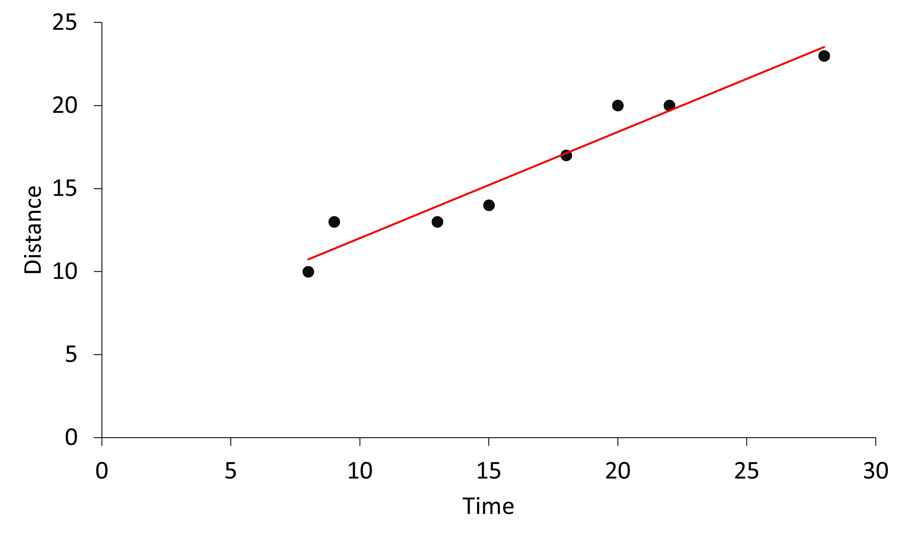

## Why exactly do we need to draw a ‘line’?

We’ve been talking about a line being made to show positive or negative association. 
But why exactly do we even need the line? Why can’t we just have the points?
The reason we have the linear function or ‘the line’ is because it has an equation. And equations are extremely important in mathematics. Let’s see what we mean by this. 

Let’s look at our previous example of dog height and weight for this as well.

We see the line drawn for this, and from other topics like algebra, we know that we can write an equation for the line. 

Let’s say the equation of the line is y = 0.9x - 21.5

This means that multiplying the value of height (x) by 0.9 and then subtracting 21.5 from it gives us the weight of the dog (y). This is true for all points that lie on the line itself. And since the line itself is the best fit line we chose based on all the points, we can use this equation of line to estimate height or weight when one of the two values are known. 
Let’s try it out with a point that we already have. What is the weight of the dog that has a height of 75?
Let’s replace the value in the equation and find out.
Weight (y) = 0.9 x Height (x) - 21.5
Weight = 0.9 x 75 - 21.5  = 46 kg
The actual value is 50 kg, which is pretty similar. Does that mean the equation is wrong? Keep in mind that we did not join all the points to make the line (since that did not even give us a line). We tried to join as many points as possible. Which means not all of them lie on the line and thus the equation will not give the exact answer as the one in the table. But the reason we have the line and the equation is because it is a pretty good estimate of height or weight, especially when we have a new value not present in the table.

What is the weight of a dog that has a height of 30 cm and what is the height of a dog that has a weight of 20 kg?

Using the equation, we can find answers to both these questions. 
Weight (y) = 0.9 x Height (x) - 21.5
Weight = 0.9 x 30 - 21.5 = 5.1 kg

Weight (y) = 0.9 x Height (x) - 21.5
20 = 0.9 x Height - 21.5
Height = 20 + 21.5 / 0.9 = 46.2 cm

Easy right?
One more thing to note about the equation is that the slope of the line is an important part as well. We have already discussed that the value of slope, whether it is positive or negative, tells us if there is a positive or negative association between the two variables. 
In the above equation, the slope is 0.9, so the association is positive, which we also see in the graph (since increase height increases the weight). 
But the slope of 0.9 also tells us that for every 1 cm increase in dog height, the weight is predicted to increase by 0.9 kg. This would make more sense if we have no intercept. Let’s the equation after removing the intercept be:
Weight (y) = 0.9 x Height (x)
Ehre, when the height is 1 cm, weight is 0.9. So an increase in height of 1 inch means that the weight will increase by 0.9 kg. So the slope is also the rate of increase or decrease of the y variable when x variable increases by 1. 

Finally, what about the intercept or - 21.5? What does it mean? If the value of x (height) is 0, the intercept is the value of y, weight in this case. 
So, if the height is 0, the weight is apparently -21.5. But how can weight even be negative? Additionally, how can a dog with no height even have a weight in the first place?
What we need to know in the case of mathematics is that at the end, they are just numbers, and they give us numerical answers, like we want them to, But in real life, there are a lot of restrictions we need to follow. Like weight not being negative. So, before blindly accepting anything as the answer, we need to check if the answer actually makes sense in the context we are talking about. The line of best fit is meant to understand the general association of the bivariate data that we have, but it might not be able to explain everything about it or might even give information that is not actually possible. But if we check the answers validity ourselves, then it is not a big deal. In this case, since it does not make sense to have a dog without height, we will also not take into account the weight that we get from replacing the value of height as 0 in the equation. 

Here is a case where the intercept might make sense. 

Say Sam’s car is 5 km away from his house. The following is the distance traveled after different times for the car. 

The the graph, we see the best fit line for this case and the equation to be as follows:
y = 0.65x + 5
In this case, when the time (x) is zero, the distance is 5 km, which means when no time has passed, Sam’s car is still 5 km away from his house. 
