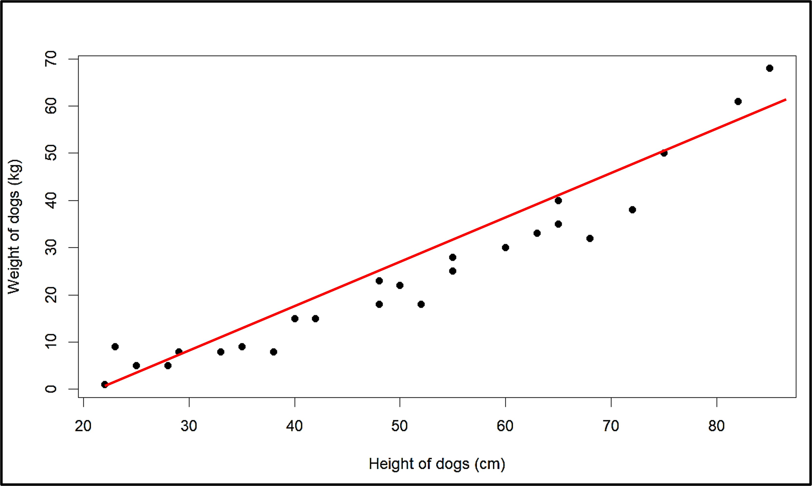
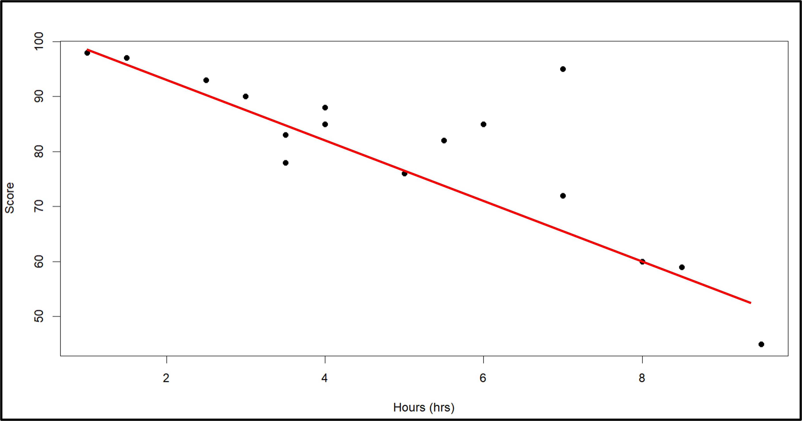
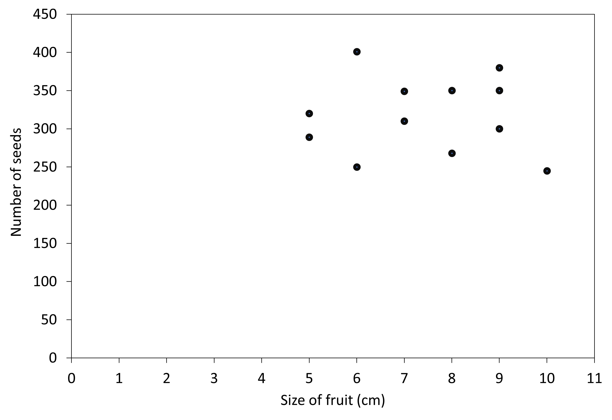
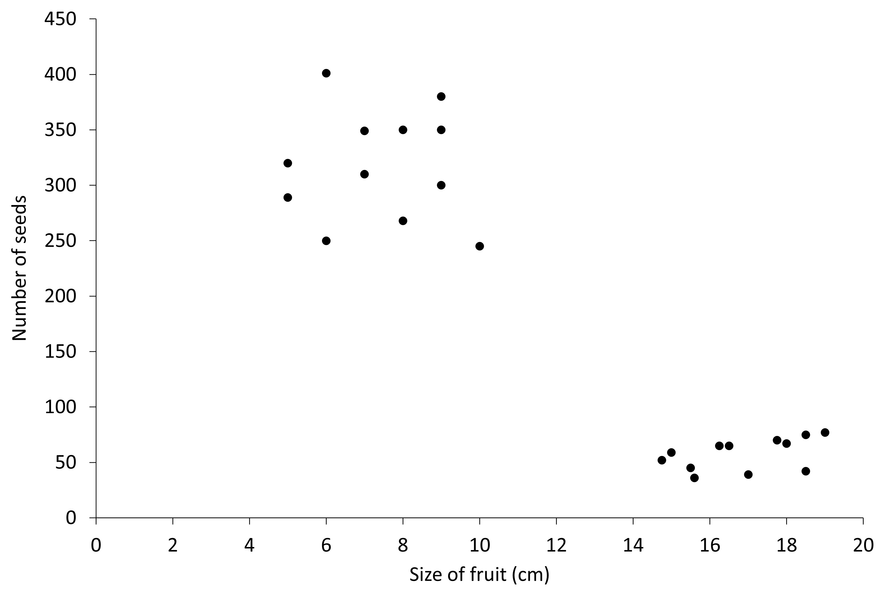
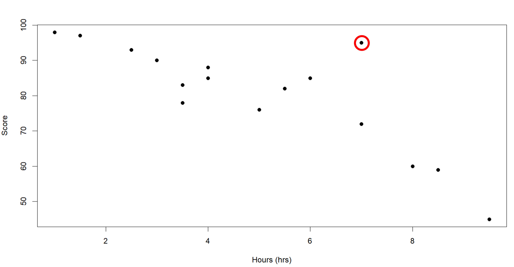
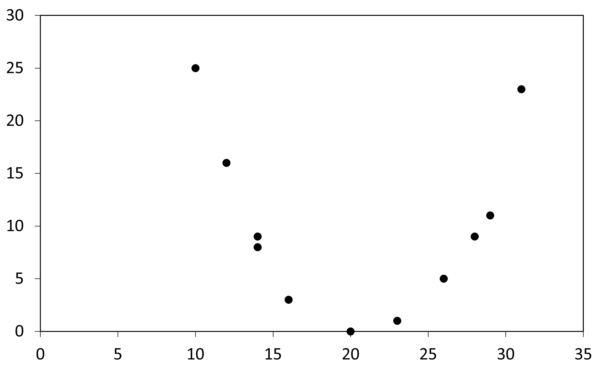

## Linear Association
 
Once we know to plot a scatter plot to see if there is any association between two variables, we should also know what kind of graphs gives us what type of relationship/association. 

The graph we just made shows us that increasing height increases the weight as well (also works when height is decreased and weight decreases as well). Here, when we look at the graph, we can draw a line that passes through most of the points.

Since the points fit on a linear function quite well, we can say that there is a linear association between the two variables. When we look at the line, we also know that the slope of the line is positive, since increasing one increases the other variable as well. So such a linear association is a positive association between the variables - hours and score.

But not all bivariate data will have a positive association. Let’s take an example and see what the plot looks like for the given situation. Given is the amount of time students spend on their phones at home and their scores in the most recent midterms. 

S02-table-for-student-score-and-screen-time.jpg

Like before, we have a lot of data which is not arranged in any way, so we make a graph to see what kind of association or pattern there is. 

This looks completely different from the previous graph. The line that passes through most of the points is as shown:

Before, there was a positive association since the slope of the line is positive as well, and an increase in one variable increases the other as well. In this case however, we see that an increase in hours spent using the phone decreases the score for students. It also means that a decrease in hours spent on the phone increased the score. This is an example of a negative association between the two variables since the slope of the line drawn is negative. 

So we saw examples where we saw positive and negative associations, which are both linear associations. Either increasing one also increases the other or increasing one decreases the other. But keep in mind that there are so many ways we can draw the line passing through the points, but we will learn more about this later.

## Clusters

But is that always the case? Is there always a positive or negative association between bivariate data? 

Let’s look at one more example. 

Given in the graph that shows a scatter plot of size of different guava fruits and the number of seeds that each fruit has. We see that there is no positive or negative relationship between the two variables. We can’t really draw a line through the data in a sensible way. But what we do see is that all the points are kind of grouped together, they form a ‘cluster’. While they have no association (positive and negative) between the two variables, the clustering on the graph shows that the size of fruit and the number of seeds is pretty similar. What we can say for sure is that increasing the size of fruit DOES NOT increase the number of seeds. Graphs like these are important when we have types of fruits. But why? Let’s see the graph below with some more data. 

We see two different group
We see two different clusters or groups here. We know that the top cluster is for guavas. The fruit size and the number of seeds is similar. We can thus conclude that the other cluster is another fruit since that cluster also has similar fruit sizes and seed numbers. 
So while there is no positive or negative linear association in this case, the presence of clusters also is a pattern in itself. 

## Outliers

Whenever we talk about data, there is always the idea of our data being wrong, either wrongfully inputted in, or some kind of a wrong reading for an instrument. 

Let’s look at the previous graph of the negative association. 

We can see that one of the points on the top right seems like it does not properly fit in the linear negative association. This point tells us that even with high hours spent on the phone, this particular student still scored pretty high, which does not fit the relationship between hours and score we concluded with. But since this point is only one point that seems different from all other points, we consider this the outlier in the dataset. Kind of like the ‘odd one out’. So this student probably studies a lot as well or maybe listens in class and thus scores pretty well while also spending a lot of time on their phone. 

## Non Linear Association

Besides the two linear associations and the clusters we have looked at, there are even more kinds of associations between data. (Obviously, we cannot just have only three kinds of relationships between two sets of data).

We can have a relationship that is quadratic as well. Just think of the points drawn on the scatterplot as arranged in such a way that a parabola would pass through most of the points. So in such a case, increasing one variable first decreases the other and then increases it (or vice versa). Since this association is not linear, we call it nonlinear to generalize it. But we can be specific and call it quadratic as well. 

